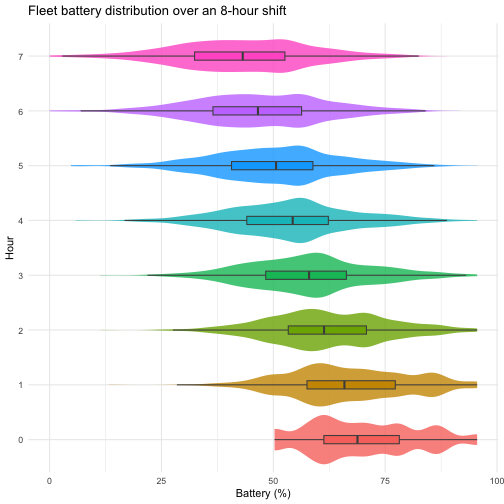

This tutorial shows how to go from a single-entity simulation (Tutorial 01) to
**cohort-level forecasting** across many independent entities. This is not an
agent-based model (ABM): couriers do not interact with each other here. A
future ABM tutorial will cover interacting entities and shared environments.

By the end you will be able to:
- build a heterogeneous cohort of couriers,
- run the cohort through an 8-hour shift,
- generate probabilistic forecasts of delivery events and battery state,
- summarize aggregate fleet outcomes (for example, total deliveries over the shift).

We use the urban food delivery model throughout. If you haven't worked through
[01_core_engine_scaffold.md](01_core_engine_scaffold.md), start there — it
covers the `Entity`, `ModelBundle`, and `Engine` concepts that this tutorial
builds on.

## Load the model

The delivery model lives in a plain R script. Sourcing it gives you
`delivery_bundle()`, `delivery_schema()`, and the individual callback functions.
No package install required.


``` r
source("tutorials/model/urban_delivery.R")
```

## Build a heterogeneous cohort

A **cohort** is just a named list of `Entity` objects. Each agent starts its
shift with a different battery level, home zone, and starting state — exactly
the kind of heterogeneity you see in a real fleet.

This is also where you can plug in a synthetic population generator if you have
one. For example, you might sample initial state from external population
distributions, then instantiate one `Entity` per sampled courier profile.


``` r
set.seed(2026)

n_couriers <- 20
shared_schema <- delivery_schema()

couriers <- lapply(seq_len(n_couriers), function(i) {
  Entity$new(
    id   = paste0("driver_", sprintf("%02d", i)),
    init = list(
      battery_pct   = runif(1, min = 50, max = 100),
      route_zone    = sample(c("urban", "suburban", "rural"), 1,
                             prob = c(0.55, 0.30, 0.15)),
      payload_kg    = 0,
      dispatch_mode = "idle"
    ),
    schema      = shared_schema,
    entity_type = "courier",
    time0       = 0
  )
})
names(couriers) <- sapply(couriers, function(e) e$id)
```

Quick sanity check — the fleet's starting battery distribution:


``` r
batteries <- map_dbl(couriers, ~ .x$current$battery_pct)
summary(batteries)
#>    Min. 1st Qu.  Median    Mean 3rd Qu.    Max. 
#>   50.27   61.30   68.81   69.91   78.15   95.55
```

## Single-agent run

Before running the full cohort, let's step through one courier to see the shape
of the output. The `Engine` is constructed once from the bundle and then reused
for every courier.


``` r
eng <- Engine$new(bundle = delivery_bundle())

out_single <- eng$run(couriers[[1]], max_events = 500, return_observations = TRUE)
```

The result contains:
- `$events` — the authoritative event log (one row per realized event)
- `$observations` — whatever the `observe()` hook emitted
- `$entity` — the same entity object, now mutated to post-run state


``` r
nrow(out_single$events)
#> [1] 14
knitr::kable(tail(out_single$observations, 5) |> tibble::rownames_to_column("obs"),
             digits = 3)
```


|obs |  time|event_type         |process_id |route_zone | battery_pct| payload_kg|dispatch_mode |
|:---|-----:|:------------------|:----------|:----------|-----------:|----------:|:-------------|
|9   | 6.274|delivery_completed |delivery   |urban      |      54.904|      2.758|in_transit    |
|10  | 6.711|dispatch_check     |dispatch   |urban      |      54.717|      3.250|assigned      |
|11  | 6.842|delivery_completed |delivery   |urban      |      52.486|      2.509|in_transit    |
|12  | 7.600|delivery_completed |delivery   |urban      |      47.547|      1.412|in_transit    |
|13  | 8.000|end_shift          |end_shift  |urban      |      47.547|      1.412|idle          |


``` r
out_single$entity$state(c("battery_pct", "dispatch_mode"))
#> <flux_state>
#> $battery_pct
#> [1] 47.54659
#> 
#> $dispatch_mode
#> [1] "idle"
```

The `observations` table rows are numbered within the observation log (here obs
9–13 are the last five), not matched to the events log which has 14 rows total.
The final event should be `end_shift` — the model's terminal event. The battery
will be lower than it started, and the courier may have completed several
deliveries during the shift.

## Cohort simulation

`run_cohort()` runs the engine over every entity in the list, optionally with
multiple parameter draws (for uncertainty quantification) and multiple simulation
replicates per draw.


``` r
cohort_result <- run_cohort(
  eng,
  entities      = couriers,
  n_param_draws = 1,
  n_sims        = 50,
  max_events    = 500,
  seed          = 42
)
```

Here:
- `n_param_draws = 1` uses one parameter set (no parameter uncertainty yet),
- `n_sims = 50` runs 50 stochastic simulations per courier,
- `max_events = 500` caps events per run for safety,
- `seed = 42` makes the run reproducible.

The result is an indexed list of run outputs. `cohort_result$index` tells you
which courier/parameter-draw/simulation each slot corresponds to.

- `sim_id` is the simulation replicate number within a courier and parameter draw.
- `run_id` is the unique row key for each realized run.


``` r
knitr::kable(head(cohort_result$index))
```


|entity_id | param_draw_id| sim_id|run_id |
|:---------|-------------:|------:|:------|
|driver_01 |             1|      1|run_1  |
|driver_01 |             1|      2|run_2  |
|driver_01 |             1|      3|run_3  |
|driver_01 |             1|      4|run_4  |
|driver_01 |             1|      5|run_5  |
|driver_01 |             1|      6|run_6  |


``` r

# Aggregate: total completed deliveries per run over the shift
delivery_counts <- map_int(cohort_result$runs, ~ sum(.x$events$event_type == "delivery_completed"))
summary(delivery_counts)
#>    Min. 1st Qu.  Median    Mean 3rd Qu.    Max. 
#>   0.000   3.000   5.000   4.727   6.000  12.000
```

## Forecasting

`fluxForecast` is one major part of the ecosystem. It takes raw simulation
output and turns it into queryable probabilistic summaries of the future.

### `forecast()` — the entry point

`forecast()` wraps the cohort run into a forecast object that downstream
functions can query. It needs the engine, the entities, and the evaluation
times (the "horizon grid" at which we want predictions).


``` r
times <- seq(0, 8, by = 1)  # include baseline hour 0 for explicit start_time

fc <- forecast(
  engine   = eng,
  entities = couriers,
  times    = times,
  S        = 80,       # forecast simulation draws per courier
  vars     = "battery_pct",
  seed     = 42
)
#> Warning: Model schema omits 'alive'; deriving lifecycle status from
#> bundle$terminal_events.
```

`S` controls the number of forecast draws generated inside `forecast()`. It is
separate from `n_sims` in `run_cohort()`, which controlled the earlier example
run. They can be the same, but they do not need to be.

If you see the warning about missing `alive`, that is expected for this model.
`fluxForecast` then derives lifecycle status from terminal events, which keeps
time-to-event summaries such as `event_prob()` well-defined.

### `event_prob()` — probability of a delivery event

"What is the probability that each courier completes at least one delivery by
hour *t*?"


``` r
ep <- event_prob(fc, event = "delivery_completed", times = times)
knitr::kable(head(ep$result), digits = 3)
```


| time| n_eligible| n_events| event_prob|  risk|
|----:|----------:|--------:|----------:|-----:|
|    0|       1600|        0|      0.000| 0.000|
|    1|       1600|      405|      0.253| 0.253|
|    2|       1600|      964|      0.603| 0.603|
|    3|       1600|     1301|      0.813| 0.813|
|    4|       1600|     1471|      0.919| 0.919|
|    5|       1600|     1529|      0.956| 0.956|


`ep` is a `flux_event_prob` object. The per-time summary table is in
`ep$result`. By default this is an aggregate cohort risk curve. It starts at
exactly 0 at
hour 0 (no courier can have completed a delivery before the shift starts) and
approaches 1 by hour 8 (most couriers complete at least one delivery).


### `state_summary()` — distribution of a state variable

"What does the battery distribution look like across the fleet at each hour?"


``` r
ss <- state_summary(fc, vars = "battery_pct", times = times)

# draws() gives us the individual values — use them for a richer plot
dr_all <- draws(fc, var = "battery_pct", times = times, start_time = 0)

dr_all |>
  filter(time < 8) |>           # hour 8: all couriers have ended shift (no data)
  mutate(hour = factor(time)) |>
  ggplot(aes(x = value, y = hour, fill = hour)) +
  ggplot2::geom_violin(show.legend = FALSE, colour = NA, alpha = 0.8) +
  ggplot2::geom_boxplot(width = 0.15, outlier.shape = NA, show.legend = FALSE,
                        colour = "grey30") +
  labs(x = "Battery (%)", y = "Hour",
       title = "Fleet battery distribution over an 8-hour shift") +
  theme_minimal()
```

<div class="figure">

<p class="caption">plot of chunk battery-ridges</p>
</div>

`state_summary()` with the default `by = "run"` returns per-time quantiles
across all draws and couriers. The fleet-wide median drops steadily; the
widening spread reflects couriers diverging as some get more assignments than
others. Hour 8 has no data because all couriers hit `end_shift` before that
tick — the terminal event removes them from the at-risk pool.

### `draws()` — inspect raw trajectories

For a single agent, you can pull the underlying simulation draws to see the
stochastic spread:


``` r
dr <- draws(fc, var = "battery_pct", times = times, start_time = 0) |>
  left_join(fc$run_index |> select(run_id, entity_tag), by = "run_id")

# Show one draw's full trajectory for driver_01 across all hours
dr |>
  filter(entity_tag == "driver_01") |>
  arrange(run_id, time) |>
  filter(run_id == first(run_id)) |>
  knitr::kable(digits = 2)
```


|run_id | time| value|entity_tag |
|:------|----:|-----:|:----------|
|run_1  |    0| 84.93|driver_01  |
|run_1  |    1| 84.93|driver_01  |
|run_1  |    2| 70.81|driver_01  |
|run_1  |    3| 61.24|driver_01  |
|run_1  |    4| 56.29|driver_01  |
|run_1  |    5| 56.29|driver_01  |
|run_1  |    6| 56.29|driver_01  |
|run_1  |    7| 52.49|driver_01  |


Each row is one draw × one time point. You get the full distribution rather than
just a summary — useful for checking whether the forecast is well-behaved or if
there are pathological outliers.

## Varying model parameters

One of the design goals of the bundle architecture is that you can swap
parameters without changing any other code. Let's compare the default dispatch
rate against a slower fleet:


``` r
# Default: dispatch_rate_base = 0.7
eng_slow <- Engine$new(bundle = delivery_bundle(
  params = list(dispatch_rate_base = 0.3)
))

fc_slow <- forecast(
  engine   = eng_slow,
  entities = couriers,
  times    = times,
  S        = 80,
  vars     = "battery_pct",
  seed     = 42
)

ep_slow <- event_prob(fc_slow, event = "delivery_completed", times = times)
```

Compare mean fleet-wide delivery probability at hour 4:


``` r
cat("Default dispatch rate — P(delivery by hour 4):",
  round(ep$result$event_prob[ep$result$time == 4], 3), "\n")
#> Default dispatch rate — P(delivery by hour 4): 0.919
cat("Slow dispatch rate   — P(delivery by hour 4):",
  round(ep_slow$result$event_prob[ep_slow$result$time == 4], 3), "\n")
#> Slow dispatch rate   — P(delivery by hour 4): 0.753
```

The slower dispatch rate produces a flatter event probability curve — agents
receive fewer assignments, so fewer deliveries are completed by any given hour.
This is exactly the kind of "what if" scenario that fleet operators care about:
if demand drops (lower dispatch rate), how does delivery throughput change?

## Summary

| Concept | What you learned |
|---------|-----------------|
| `Entity` cohort | A named list of couriers (independent entities) with heterogeneous starting state |
| `run_cohort()` | Batch simulation with parameter draws and replicates |
| `forecast()` | Wraps cohort output into a queryable forecast object |
| `event_prob()` | Probability of a named event by time *t* |
| `state_summary()` | Distribution of a state variable at each time point |
| `draws()` | Raw per-draw trajectories for detailed inspection |
| Parameter variation | Swap `delivery_bundle(params = ...)` to test scenarios |

**Next:** [03_decisions_policy.md](03_decisions_policy.md) — add decision points
and policies to the model, compare agent outcomes under different dispatch
strategies.
