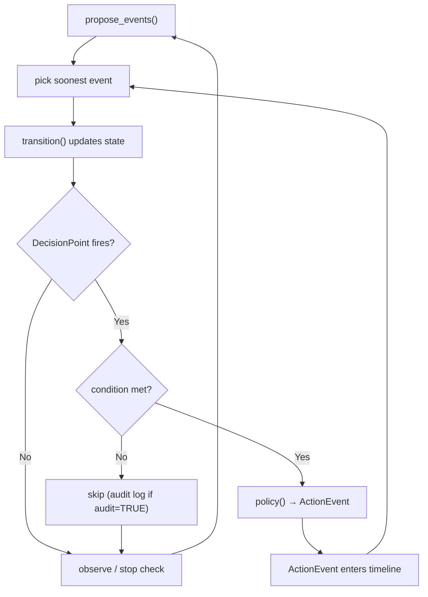
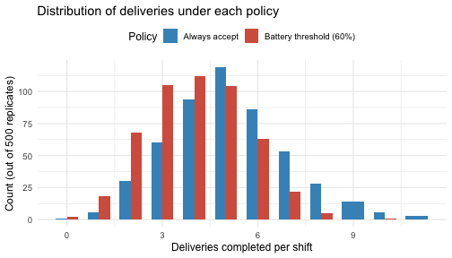

In [Tutorial 02](02_cohort_forecast.md), every courier followed the same
mechanistic process: dispatches arrived, deliveries completed, batteries
drained — all without anyone making choices. Real systems involve **decisions**: a dispatcher choosing whether to
accept or decline an assignment, a routing algorithm picking surge vs normal
mode, a fleet manager pulling a low-battery vehicle off the road.

This tutorial introduces **decision points** and **policies** — the mechanism
by which choices are injected into the simulation timeline. A **policy** is a
function that looks at the courier's current state and proposes an action: accept
the dispatch (take the payload, spend battery to deliver it) or decline (stay
idle, conserve battery for later). Accepting means more deliveries completed
but faster battery depletion; declining preserves range at the cost of missed
work. The question we will answer: *does a simple battery-conservation policy
improve the delivery-vs-battery trade-off compared to always accepting?*

By the end you will be able to:

- declare a decision point on the delivery schema,
- write a policy function that proposes actions,
- compare outcomes under two different policies with identical seeds,
- inspect trajectory records to see exactly why each decision was made,
- view the distribution of counterfactual outcomes across many runs.

## Setup


``` r
library(fluxCore)
source("tutorials/model/urban_delivery.R")
set.seed(2026)
```

## The decision: accept or decline a dispatch

Recall the model from Tutorial 01. The simulation runs in discrete steps:
each step, competing event streams (dispatch arrivals, delivery completions,
shift end) each propose a next-event time; the engine picks the soonest one,
advances the clock, and calls `transition()` to update state variables.
Among those events is `dispatch_check` — the moment a new delivery assignment
arrives and the courier is offered work.

In the base model, `dispatch_check` always results in the courier accepting:
the transition assigns a route, adds payload, and deducts battery. But what if
a fleet management system could **decline** an assignment — for example, when
battery is too low to safely complete the delivery?

This is a natural decision point. Let's formalize it.

## Declaring a decision point

A **decision point** is a named checkpoint in the event timeline where the
simulation pauses to ask: *should something intervene here?* When a decision
point fires, the engine calls your policy function and gives it a chance to
propose an action — for example, "decline this dispatch" or "switch to surge
mode". If no policy is attached, the simulation proceeds as if the checkpoint
were not there.

Decision points are declared on the schema, not buried in transition logic.
This keeps the interface explicit and auditable.



Here is how we declare the dispatch decision point. Because we want the
engine to handle `accept` and `decline` events directly — without writing a
custom transition function — we attach **action handlers** to the decision
point itself. Each handler is a function that receives the entity and event
and returns state updates:


``` r
dp_dispatch <- DecisionPoint(
  id              = "dispatch_decision",
  trigger         = "dispatch_check",
  allowed_actions = c("accept", "decline"),
  action_handlers = list(
    accept = function(entity, event) {
      # Accepting is a no-op: the base transition already assigned route,
      # payload, and charged battery at dispatch_check.
      NULL
    },
    decline = function(entity, event) {
      # Declining reverses the dispatch: drop payload, refund battery,
      # and return to idle.
      battery_before_dispatch <- as.numeric(entity$current$battery_pct)
      list(dispatch_mode = "idle", payload_kg = 0)
    }
  )
)
```

The fields:

- **`trigger`**: which event(s) cause this decision point to fire. Here,
  `"dispatch_check"` — the checkpoint activates every time a dispatch arrives.

- **`allowed_actions`**: the set of actions the policy may propose.
  Anything outside this set is rejected by the engine.

- **`action_handlers`**: a named list mapping each action type to a function
  `function(entity, event) → list(state_updates)` or `NULL`. When the engine
  picks up an ActionEvent whose type has a handler here, it calls the handler
  directly — no custom `transition()` or bundle wrapper needed. The handler's
  return value is applied as state updates just like a transition would.

- **`condition`** (not used yet): an optional function `function(entity)`
  evaluated *after* the trigger transition. If it returns `FALSE`, the policy
  is skipped. We will introduce it later.

- **`audit`** (default `FALSE`): when `TRUE`, the engine logs a record even
  for cycles where `condition` suppressed the policy call.

Now assemble a full schema object (variables + time_spec + decision points):


``` r
schema_with_dp <- set_schema(
  vars            = delivery_schema(),
  time_spec       = time_spec(unit = "hours"),
  decision_points = list(dp_dispatch)
)
```

## Writing policies

A **policy** is a plain R function that receives the firing decision point and
the current courier state, and returns an `ActionEvent` proposing what should
happen next — or `NULL` for "no intervention."

### Policy A: always accept

The simplest possible policy — accept every dispatch regardless of state.
This is equivalent to having no policy at all, and serves as a baseline.


``` r
policy_always_accept <- function(decision_point, entity) {
  ActionEvent(
    action_type = "accept",
    time_next   = entity$last_time + 0.01
  )
}
```

### Policy B: battery threshold

Decline if battery has dropped below 60%. The idea: a courier running low on
battery should stop taking new assignments and coast to shift end rather than
risk stranding mid-delivery.


``` r
policy_battery_threshold <- function(decision_point, entity) {
  battery <- as.numeric(entity$current$battery_pct)

  action <- if (!is.null(battery) && battery < 60) "decline" else "accept"

  ActionEvent(
    action_type = action,
    time_next   = entity$last_time + 0.01,
    metadata    = list(battery_at_decision = battery)
  )
}
```

## Assembling with `load_model()`

With `action_handlers` on the decision point, we don't need a custom
transition function or a bundle wrapper. The base `delivery_bundle()` handles
all natural events (dispatch, delivery, end_shift), and the engine routes
action events to the handlers automatically.

`load_model()` validates that the schema, bundle, policy, and trajectory
configuration are mutually consistent before any run begins.

Reproducibility is controlled through a `RuntimeContext`. Passing a `seed`
ensures that every stochastic draw during the run starts from a known state.
Using the same seed across both models makes the comparison meaningful: every
difference in outcome is caused by the policy, not by random chance.


``` r
model_accept <- load_model(
  schema     = schema_with_dp,
  bundle     = delivery_bundle(),
  policy     = policy_always_accept,
  trajectory = list(detail = "summary"),
  runtime    = RuntimeContext(seed = 500)
)

model_threshold <- load_model(
  schema     = schema_with_dp,
  bundle     = delivery_bundle(),
  policy     = policy_battery_threshold,
  trajectory = list(detail = "summary"),
  runtime    = RuntimeContext(seed = 500)
)
```

## Running both policies from the same seed

The power of the decision-point architecture: same courier, same seed, same
stochastic draws — but different policies yield different outcomes. We create
two identical couriers (same starting state) and run each through its
respective model.


``` r
courier <- Entity$new(
  id          = "courier_A",
  init        = list(
    battery_pct   = 80,
    route_zone    = "urban",
    payload_kg    = 0,
    dispatch_mode = "idle"
  ),
  schema      = delivery_schema(),
  entity_type = "courier",
  time0       = 0
)

# Deep copy so both runs start from identical state
courier2 <- courier$clone(deep = TRUE)

out_accept    <- model_accept$run(courier,  max_events = 500, return_observations = TRUE)
out_threshold <- model_threshold$run(courier2, max_events = 500, return_observations = TRUE)
```

## Comparing outcomes

Let's look at the headline numbers: how many deliveries did each courier
complete, and how much battery was left at the end of the shift?


``` r
# Count deliveries completed under each policy
count_deliveries <- function(out) {
  sum(out$events$event_type == "delivery_completed", na.rm = TRUE)
}

cat("Always-accept policy:\n")
#> Always-accept policy:
cat("  Deliveries completed:", count_deliveries(out_accept), "\n")
#>   Deliveries completed: 4
cat("  Final battery:       ", round(out_accept$entity$current$battery_pct, 1), "%\n\n")
#>   Final battery:        59.2 %

cat("Battery-threshold policy:\n")
#> Battery-threshold policy:
cat("  Deliveries completed:", count_deliveries(out_threshold), "\n")
#>   Deliveries completed: 4
cat("  Final battery:       ", round(out_threshold$entity$current$battery_pct, 1), "%\n")
#>   Final battery:        59.2 %
```

The always-accept courier takes every dispatch and drains the battery more
aggressively — potentially completing more deliveries but at higher risk of
hitting critical battery levels. The threshold courier conserves energy by
declining late-shift dispatches when battery is low.

## Inspecting trajectory records

Every time a decision point fires, the engine records what happened in a
`TrajectoryRecord`. Think of it as the simulation's decision log: it captures
the courier's state at the moment of the decision, what the policy proposed,
and what the state looked like afterward. This is what allows you to go back
after a run and ask *why* a particular decision was made.


``` r
# How many decisions were made?
cat("Decisions (accept policy):   ", length(out_accept$trajectory_records), "\n")
#> Decisions (accept policy):    3
cat("Decisions (threshold policy):", length(out_threshold$trajectory_records), "\n")
#> Decisions (threshold policy): 3
```

Inspect a single record to see the structure:


``` r
tr <- out_threshold$trajectory_records[[1]]
data.frame(
  Field = c("Time", "Decision point", "Action proposed",
            "Battery before", "Battery after"),
  Value = c(round(tr$t, 3), tr$decision_point_id,
            tr$selected_action$action_type,
            tr$state_before$battery_pct, tr$state_after$battery_pct)
) |> kable()
```


|Field           |Value             |
|:---------------|:-----------------|
|Time            |0.363             |
|Decision point  |dispatch_decision |
|Action proposed |accept            |
|Battery before  |80                |
|Battery after   |79.5756965860172  |


`state_before` and `state_after` bracket the *trigger event* (`dispatch_check`).
The base transition assigns a route, adds payload, and charges a battery cost
all in one step — so you will typically see battery drop between `state_before`
and `state_after`. The `accept` action handler is a no-op (everything was
already handled by the trigger), while `decline` reverses the assignment by
resetting mode to idle and dropping payload.

`trajectory_table()` collects all records into a data frame, with one row per
decision and columns for time, state variables, and the action taken. Look for
the moment the policy starts declining — that's where the battery crosses 60%
and the courier switches from accepting everything to coasting to end of shift.


``` r
tr_df <- trajectory_table(out_threshold$trajectory_records,
                          vars = c("battery_pct", "dispatch_mode"))
head(tr_df, 10) |> kable(digits = 2)
```


|    t|decision_point_id |trigger_event  |action_taken |condition_met | battery_pct_before| battery_pct_after|dispatch_mode_before |dispatch_mode_after |
|----:|:-----------------|:--------------|:------------|:-------------|------------------:|-----------------:|:--------------------|:-------------------|
| 0.36|dispatch_decision |dispatch_check |accept       |NA            |              80.00|             79.58|idle                 |assigned            |
| 7.50|dispatch_decision |dispatch_check |accept       |NA            |              68.40|             60.05|completed            |assigned            |
| 7.72|dispatch_decision |dispatch_check |decline      |NA            |              60.05|             59.25|assigned             |assigned            |


## Using `condition` to restrict when the policy runs

In `policy_battery_threshold` above, the battery check lives inside the
policy function itself. That’s fine for simple cases, but it conflates two
concerns: *when* to intervene and *what* to do. If you always want to decline
when battery is critically low — regardless of which policy is plugged in —
you can move the guard out of the policy and onto the decision point.

The `condition` parameter accepts a function `function(entity)` that is
evaluated after the transition (so it sees current state). If it returns
`FALSE`, the policy is never called for that cycle.

Here we set a stricter threshold (25%) as a hard rule on the decision point.
The policy itself becomes trivial — it always proposes "decline" because it
only runs when the condition has already determined that intervention is
warranted:


``` r
dp_dispatch_cond <- DecisionPoint(
  id              = "dispatch_decision",
  trigger         = "dispatch_check",
  condition       = function(entity) entity$current$battery_pct < 25,
  allowed_actions = c("decline"),
  action_handlers = list(
    decline = function(entity, event) {
      list(dispatch_mode = "idle", payload_kg = 0)
    }
  ),
  audit           = TRUE,
  label           = "Decline dispatch when battery is critically low; log all visits"
)

schema_cond <- set_schema(
  vars            = delivery_schema(),
  time_spec       = time_spec(unit = "hours"),
  decision_points = list(dp_dispatch_cond)
)

# Policy is now unconditional: the condition handles the filtering,
# so every time this policy is called, the answer is always "decline".
policy_decline_only <- function(decision_point, entity) {
  ActionEvent(
    action_type = "decline",
    time_next   = entity$last_time + 0.01
  )
}

model_cond <- load_model(
  schema     = schema_cond,
  bundle     = delivery_bundle(),
  policy     = policy_decline_only,
  trajectory = list(detail = "summary"),
  runtime    = RuntimeContext(seed = 99)
)
```

Also, `audit = TRUE` is introduced here. Normally, when `condition` returns
`FALSE` — meaning the battery is still healthy — the checkpoint fires and is
immediately skipped with no record kept. With `audit = TRUE`, a record is
written for *every* `dispatch_check` visit, whether or not the condition was
met. Records where the policy was suppressed carry `condition_met = FALSE`
and `selected_action = NULL`. This gives you a full picture of when couriers
were and were not at risk.

Run on the same courier with the same seed:


``` r
courier_cond <- Entity$new(
  id          = "courier_A",
  init        = list(battery_pct=80, route_zone="urban",
                     payload_kg=0, dispatch_mode="idle"),
  schema      = delivery_schema(),
  entity_type = "courier",
  time0       = 0
)

out_cond <- model_cond$run(courier_cond, max_events = 500,
                           return_observations = TRUE)
```

Because `audit = TRUE`, the trajectory records include every
`dispatch_check` visit — not just the ones where the policy was called:


``` r
cond_flags <- sapply(out_cond$trajectory_records, function(tr) tr$condition_met)

cat("Total DP visits (all dispatch_check events):",
    length(out_cond$trajectory_records), "\n")
#> Total DP visits (all dispatch_check events): 3
cat("Condition met  (battery < 25, policy called):",
    sum(cond_flags == TRUE, na.rm = TRUE), "\n")
#> Condition met  (battery < 25, policy called): 0
cat("Condition not met (battery >= 25, skipped):  ",
    sum(cond_flags == FALSE, na.rm = TRUE), "\n")
#> Condition not met (battery >= 25, skipped):   3
```

The `condition_met` field in each record tells you which visits had the policy
consulted (`TRUE`) and which were logged but skipped (`FALSE`). The
`trajectory_table()` helper brings this into a data frame alongside the state
variables you care about:


``` r
tr_cond_df <- trajectory_table(out_cond$trajectory_records,
                               vars = c("battery_pct", "dispatch_mode"))
head(tr_cond_df[, c("t", "condition_met", "action_taken",
                    "battery_pct_before", "dispatch_mode_before")], 8) |>
  kable(digits = 2)
```


|    t|condition_met |action_taken | battery_pct_before|dispatch_mode_before |
|----:|:-------------|:------------|------------------:|:--------------------|
| 3.49|FALSE         |NA           |              80.00|idle                 |
| 5.70|FALSE         |NA           |              65.53|in_transit           |
| 6.19|FALSE         |NA           |              60.80|in_transit           |


Rows with `condition_met = FALSE` are the visits where battery was still above
25% and no action was needed. Rows with `condition_met = TRUE` are the ones
where the policy ran and proposed "decline".

The two approaches — state check in the policy function vs. `condition` on the
`DecisionPoint` — produce identical behavioral outcomes. Use `condition` when
the guard is always the same regardless of policy, or when you want the
audit trail to capture every checkpoint visit.

## Multiple decision points per event cycle

A schema can carry more than one decision point attached to the same trigger.
Each fires **independently**: the engine checks the condition (if any) and
calls the policy separately for each active checkpoint in the same event step.
When both propose actions, both `ActionEvent`s enter a queue and
**arbitration** picks the one with the earliest `time_next`.

A common pattern is a tiered response: one checkpoint handles the routine
accept/decline decision, and a second handles an emergency override when the
battery reaches a critical threshold. Because the critical override should
always win, it is given a slightly smaller `time_next` offset so it is
scheduled ahead of the routine action:


``` r
dp_standard <- DecisionPoint(
  id              = "dispatch_accept",
  trigger         = "dispatch_check",
  allowed_actions = c("accept", "decline"),
  action_handlers = list(
    accept  = function(entity, event) NULL,
    decline = function(entity, event) list(dispatch_mode = "idle", payload_kg = 0)
  ),
  label           = "Routine accept/decline decision"
)

dp_critical <- DecisionPoint(
  id              = "battery_critical",
  trigger         = "dispatch_check",
  condition       = function(entity) entity$current$battery_pct < 10,
  allowed_actions = c("decline"),
  action_handlers = list(
    decline = function(entity, event) list(dispatch_mode = "idle", payload_kg = 0)
  ),
  audit           = TRUE,
  label           = "Emergency override: battery critically low"
)

schema_two_dps <- set_schema(
  vars            = delivery_schema(),
  time_spec       = time_spec(unit = "hours"),
  decision_points = list(dp_standard, dp_critical)
)
```

When battery is above 10%, only `dp_standard` is active and the routine
policy runs. When battery drops below 10%, **both** checkpoints fire:
`dp_standard` proposes its action and `dp_critical` also proposes "decline".
Arbitration picks whichever has the smaller `time_next`. By giving the
critical override a smaller offset (`+ 0.001` vs. `+ 0.01`), it always wins
when both are active:


``` r
policy_two_dps <- function(decision_point, entity) {
  battery <- as.numeric(entity$current$battery_pct)

  if (decision_point$id == "battery_critical") {
    # Emergency override fires first (time_next offset smaller).
    return(ActionEvent(
      action_type = "decline",
      time_next   = entity$last_time + 0.001,
      metadata    = list(reason = "battery_critical")
    ))
  }

  # Routine policy: accept unless battery < 25.
  action <- if (!is.null(battery) && battery < 25) "decline" else "accept"
  ActionEvent(
    action_type = action,
    time_next   = entity$last_time + 0.01
  )
}
```

With two checkpoints both proposing actions in the same event step, the one
with `time_next = last_time + 0.001` is scheduled first. The action handler
processes "decline" and the run continues; the second proposal from the routine
checkpoint has no further effect.

> **Arbitration rule:** When multiple proposed actions are waiting, the engine
> picks the one scheduled earliest (smallest `time_next`). If two proposals
> share the same time, the ordering is not defined — encode priority by
> choosing distinct offsets.

## Distribution of outcomes across many runs

One seed is one sample path. To see the real trade-off, run the same courier
500 times under each policy — each replicate gets its own seed, so the
stochastic draws (dispatch timing, battery drain, route) vary across runs, but
the comparison between policies is exact within each replicate because both
use the same seed.


``` r
make_fresh_courier <- function() {
  Entity$new(
    id          = "courier_A",
    init        = list(battery_pct = 80, route_zone = "urban",
                       payload_kg = 0, dispatch_mode = "idle"),
    schema      = delivery_schema(),
    entity_type = "courier",
    time0       = 0
  )
}

n_reps <- 500

dist_results <- lapply(seq_len(n_reps), function(s) {
  m_a <- load_model(
    schema  = schema_with_dp, bundle = delivery_bundle(),
    policy  = policy_always_accept, trajectory = list(detail = "none"),
    runtime = RuntimeContext(seed = s)
  )

  m_t <- load_model(
    schema  = schema_with_dp, bundle = delivery_bundle(),
    policy  = policy_battery_threshold, trajectory = list(detail = "none"),
    runtime = RuntimeContext(seed = s)
  )
  oa <- m_a$run(make_fresh_courier(), max_events = 500)
  ot <- m_t$run(make_fresh_courier(), max_events = 500)
  tibble(
    replicate     = s,
    del_accept    = count_deliveries(oa),
    del_threshold = count_deliveries(ot),
    bat_accept    = oa$entity$current$battery_pct,
    bat_threshold = ot$entity$current$battery_pct
  )
}) |> bind_rows()
```

Because both policies run with the same seed in each replicate, we can compute
the *within-replicate* difference — the pure causal effect of switching policy,
with all randomness held constant:


``` r
results <- dist_results |>
  mutate(
    delta_del = del_threshold - del_accept,
    delta_bat = bat_threshold - bat_accept
  )

summary_tbl <- tribble(
  ~Metric,                                ~Value,
  "Deliveries (accept): mean",            round(mean(results$del_accept), 1),

  "Deliveries (accept): median",          median(results$del_accept),
  "Deliveries (threshold): mean",         round(mean(results$del_threshold), 1),
  "Deliveries (threshold): median",       median(results$del_threshold),
  "Delta deliveries: mean",               round(mean(results$delta_del), 2),
  "P(threshold > accept) — deliveries",   round(mean(results$delta_del > 0), 2),
  "Delta battery: mean",                  round(mean(results$delta_bat), 1),
  "P(threshold > accept) — battery",      round(mean(results$delta_bat > 0), 2)
)
kable(summary_tbl)
```


|Metric                             | Value|
|:----------------------------------|-----:|
|Deliveries (accept): mean          |  5.10|
|Deliveries (accept): median        |  5.00|
|Deliveries (threshold): mean       |  4.00|
|Deliveries (threshold): median     |  4.00|
|Delta deliveries: mean             | -1.06|
|P(threshold > accept) — deliveries |  0.00|
|Delta battery: mean                |  2.00|
|P(threshold > accept) — battery    |  0.42|


There is a genuine trade-off — and in a non-trivial fraction of runs, the
threshold policy actually delivers *more* than the always-accept policy. This
happens when greedily accepting every dispatch early in the shift burns battery
that would have been needed for dispatches later. The distribution of
counterfactual outcomes is the right object to reason about, not a single
point estimate.


``` r
# Reshape to long form for plotting
plot_df <- results |>
  select(replicate, del_accept, del_threshold) |>
  pivot_longer(cols = c(del_accept, del_threshold),
               names_to = "policy", values_to = "deliveries") |>
  mutate(policy = recode(policy,
    del_accept    = "Always accept",
    del_threshold = "Battery threshold (60%)"
  ))

ggplot(plot_df, aes(x = deliveries, fill = policy)) +
  geom_bar(position = "dodge", width = 0.7) +
  scale_fill_manual(values = c("Always accept" = "#4393C3",
                                "Battery threshold (60%)" = "#D6604D")) +
  labs(
    x    = "Deliveries completed per shift",
    y    = "Count (out of 500 replicates)",
    fill = "Policy",
    title = "Distribution of deliveries under each policy"
  ) +
  theme_minimal(base_size = 12) +
  theme(legend.position = "top")
```



## What trajectory records enable

`TrajectoryRecord` is not just an audit log. It is the structured surface that
the rest of the flux ecosystem builds on:

- **Policy comparison**: run the same courier under two policies with the same
  seed; diff the trajectory_records to see where and why they diverge.
- **Counterfactual analysis**: fix seed + parameter draw; vary only the policy;
  compare outcomes.
- **RL training** (future: `fluxSim`): the `(observation, action, reward,
  next_state)` tuple for each record becomes a training transition.
- **Audit and explainability**: for any individual run, reconstruct the full
  decision history and ask "why did the simulation do that?"

## Summary

| Concept | What you learned |
|---------|-----------------|
| `DecisionPoint()` | Declares where in the event timeline a policy is consulted |
| `trigger` | Pre-transition gate: char event name(s) or `function(event)` on event-level fields |
| `action_handlers` | Named list of `function(entity, event)` — engine calls these directly for action events, no custom bundle needed |
| `condition` | Post-transition guard: `function(entity)` on updated state; when it returns `FALSE` the policy call is skipped |
| `audit = TRUE` | Emit `TrajectoryRecord` even when `condition` suppressed the policy; `condition_met = FALSE` flags those records |
| Policy function | `function(decision_point, entity)` → `ActionEvent` or NULL; add `sim_ctx` / `param_ctx` to the signature only when needed |
| `ActionEvent()` | The proposed intervention — enters the timeline like any other event |
| `load_model()` | Validates schema + bundle + policy + trajectory config together |
| Trajectory records | Per-decision audit trail: `observation`, `action`, `state_before/after`, `condition_met` |
| Same seed, different policy | Isolates the causal effect of the policy on outcomes |
| Multiple DPs + arbitration | Multiple DPs can fire in one event cycle; earliest `time_next` wins |

**Next:** [05_prepare_operational_data.md](05_prepare_operational_data.md) —
generate synthetic operational logs and prepare them into train/test/validation
format with `fluxPrepare`.
