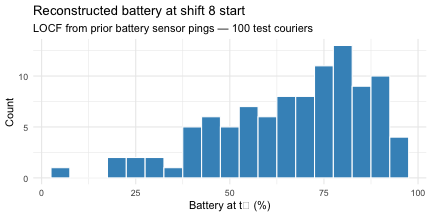
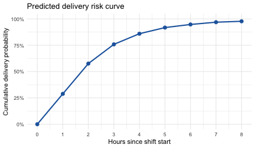
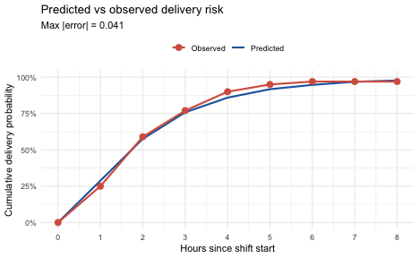
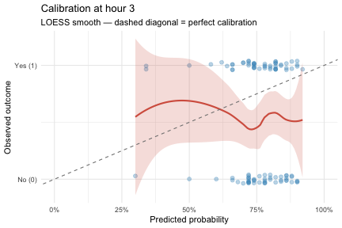
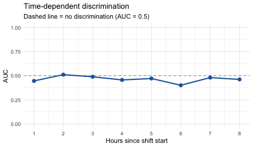
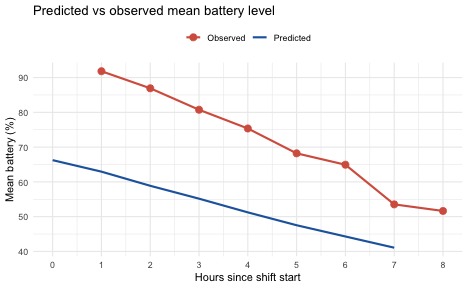

A model that simulates convincingly is not automatically a model you should
trust. The delivery model from Tutorial 01 produces realistic-looking
trajectories: batteries drain, dispatches arrive, deliveries complete. But
until you've tested its predictions against held-out data, you have no idea
whether its rates, timing distributions, and state dynamics actually match
what happens in the real fleet.

This tutorial closes that loop. We take the test-set couriers from Tutorial 04,
forecast from each courier's reconstructed state at the start of their most
recent shift, and compare the model's predictions against what was actually
observed. By the end you will be able to:

- select appropriate evaluation episodes for held-out entities,
- reconstruct entity state at a forecast anchor time from historical observations,
- run `forecast()` with state-variable tracking enabled,
- build an observed outcome grid aligned to the forecast's evaluation times,
- compare predicted and observed event risk curves with `validate_event_risk()`,
- assess per-entity calibration and discrimination with `event_prob(by = "entity")`,
- compare predicted and observed state trajectories with `validate_state_point()`.

## Setup


``` r
source("tutorials/model/urban_delivery.R")
source("tutorials/model/urban_delivery_data.R")
```

The time origin must be consistent throughout — events, observations, and
forecast anchors must all be measured on the same clock. We establish it once
here and pass it everywhere.


``` r
fleet_origin <- as.POSIXct("2026-01-05 06:00:00", tz = "UTC")
ts <- time_spec(unit = "hours", origin = fleet_origin)
```

## Data pipeline (from Tutorial 04)

We regenerate the same fleet data and run the same preparation steps as
Tutorial 04. In practice you would load these from disk; here we re-run for
self-containedness.


``` r
set.seed(42)
ops <- generate_delivery_log(n_couriers = 500, n_shifts = 8)
```


``` r
events_prep <- prepare_events(
  events    = ops$events,
  id_col    = "entity_id",
  time_col  = "time",
  type_col  = "event_type",
  time_spec = ts,
  sort      = TRUE
)

battery_spec <- list(id_col = "entity_id", time_col = "time", vars = "battery_pct")

obs_prep <- prepare_observations(
  tables    = list(battery = ops$battery),
  specs     = list(battery = battery_spec),
  time_spec = ts,
  sort      = TRUE
)
```

Both `events_prep$time` and `obs_prep$time` are now in numeric hours from
`fleet_origin`. That shared reference frame is what allows
`reconstruct_state_at()` to find observations that precede a forecast anchor
time — if the clocks don't match, the lookup returns nothing.


``` r
splits <- generate_splits(ops$couriers, train_frac = 0.6, test_frac = 0.2,
                          seed = 123)
test_ids <- splits$entity_id[splits$split == "test"]
cat("Test couriers:", length(test_ids), "\n")
#> Test couriers: 100
```

## Selecting evaluation episodes

Every test-set courier ran eight shifts. For each courier we choose their
**last shift** as the evaluation episode. This choice maximises the prior
observation history available for state reconstruction: by shift 8 there are
seven full shifts of battery readings to draw on.


``` r
test_episodes <- ops$shifts |>
  filter(entity_id %in% test_ids) |>
  group_by(entity_id) |>
  slice_max(shift_end, n = 1) |>
  ungroup() |>
  mutate(
    t0             = as.numeric(difftime(shift_start, fleet_origin, units = "hours")),
    shift_length_h = as.numeric(difftime(shift_end, shift_start, units = "hours"))
  )

kable(head(test_episodes[, c("entity_id", "shift_id", "shift_length_h", "t0")], 10),
      digits = 1,
      col.names = c("entity_id", "shift", "shift_h", "t0_hours"),
      caption = "First 10 of 100 test couriers — last shift per entity")
```


Table: First 10 of 100 test couriers — last shift per entity

|entity_id   |shift               | shift_h| t0_hours|
|:-----------|:-------------------|-------:|--------:|
|courier_003 |courier_003_shift_8 |       6|      154|
|courier_006 |courier_006_shift_7 |       8|      144|
|courier_008 |courier_008_shift_8 |       8|      168|
|courier_009 |courier_009_shift_8 |       8|      168|
|courier_012 |courier_012_shift_8 |       6|      154|
|courier_018 |courier_018_shift_8 |       8|      168|
|courier_021 |courier_021_shift_7 |       8|      144|
|courier_029 |courier_029_shift_7 |       8|      144|
|courier_030 |courier_030_shift_8 |       6|      154|
|courier_031 |courier_031_shift_8 |       8|      168|


Each row is one forecast episode. `t0_hours` is the absolute model time at
which the shift starts — and therefore the time at which we need to know the
courier's battery level before we can forecast.

## Reconstructing state at t₀

`reconstruct_state_at()` looks backward through each entity's observation
history and returns the most recent recorded value of each requested variable
at or before the anchor time. This is sometimes called an "as-of" query or
LOCF (last observation carried forward).


``` r
anchors <- test_episodes[, c("entity_id", "t0")]

state_at_t0 <- reconstruct_state_at(
  anchors      = anchors,
  observations = obs_prep,
  vars         = "battery_pct",
  id_col       = "entity_id",
  time_col     = "t0"
)

kable(head(state_at_t0[, c("entity_id", "t0", "battery_pct", ".prov_battery_pct")], 10),
      digits = 1,
      col.names = c("entity_id", "t0_hours", "battery_pct", "provenance"),
      caption = "First 10 of 100 test couriers")
```


Table: First 10 of 100 test couriers

|entity_id   | t0_hours| battery_pct|provenance      |
|:-----------|--------:|-----------:|:---------------|
|courier_003 |      154|        56.5|carried_forward |
|courier_006 |      144|        75.9|carried_forward |
|courier_008 |      168|        43.6|carried_forward |
|courier_009 |      168|        40.0|carried_forward |
|courier_012 |      154|        89.8|carried_forward |
|courier_018 |      168|        78.8|carried_forward |
|courier_021 |      144|        58.4|carried_forward |
|courier_029 |      144|        64.5|carried_forward |
|courier_030 |      154|        53.4|carried_forward |
|courier_031 |      168|        58.0|carried_forward |


The `provenance` column tells you how each value was reconstructed:
`"observed"` means a battery reading existed within the default lookback window;
`"missing"` means no prior reading was found. Any entity with `"missing"` will
receive a fallback value when we build the Entity objects below.

Plotting the reconstructed battery levels confirms that couriers start their
last shift in a range that reflects real operational wear (not always fully
charged):


``` r
ggplot(state_at_t0, aes(x = battery_pct)) +
  geom_histogram(binwidth = 5, fill = "#4393C3", colour = "white") +
  labs(x = "Battery at t\u2080 (%)", y = "Count",
       title = "Reconstructed battery at shift 8 start",
       subtitle = "LOCF from prior battery sensor pings — 100 test couriers") +
  theme_minimal(base_size = 11)
```



## Building forecast entities

We create one `Entity` per test episode. Every entity gets `time0 = 0` —
meaning the simulation clock starts at zero (the shift start) regardless of
what absolute model time that corresponds to. All times in the forecast and in
the observed outcome grid will be expressed as **hours since shift start**.
This keeps the comparison meaningful when different couriers' shifts begin at
different absolute times.


``` r
shared_schema <- delivery_schema()

entity_tbl <- state_at_t0 |>
  mutate(battery_init = coalesce(battery_pct, 80)) |>   # fall back to 80% if missing
  rowwise() |>
  mutate(entity = list(
    Entity$new(
      id          = entity_id,
      init        = list(
        battery_pct   = battery_init,
        route_zone    = "urban",
        payload_kg    = 0,
        dispatch_mode = "idle"
      ),
      schema      = shared_schema,
      entity_type = "courier",
      time0       = 0
    )
  )) |>
  ungroup()

# forecast() expects a named list of Entity objects
test_entities <- setNames(entity_tbl$entity, entity_tbl$entity_id)
```

## Forecasting from test-set baselines

`forecast()` runs S stochastic simulations per entity and collects snapshots at
each requested time. We include `time = 0` so the forecast object has an
explicit start time to anchor the cumulative incidence calculation, and we pass
`vars = "battery_pct"` so the forecast object stores battery state at each
snapshot for the state-comparison step later.


``` r
eng  <- Engine$new(bundle = delivery_bundle())
times <- seq(0, 8, by = 1)   # hours 0–8 relative to each entity's shift start

fc <- forecast(
  engine   = eng,
  entities = test_entities,
  times    = times,
  S        = 50,
  vars     = "battery_pct",
  seed     = 42
)

cat("Entities:", length(test_entities), "\n")
#> Entities: 100
cat("Draws per entity:", 50, "\n")
#> Draws per entity: 50
cat("Total runs:", length(test_entities) * 50, "\n")
#> Total runs: 5000
```

## Predicted event risk curve

`event_prob()` computes cumulative delivery risk: among all couriers in the
forecast cohort who have not yet completed a delivery by hour 0 (all of them,
since no deliveries happen at the very start of a shift), what fraction have a
delivery by hour *t*?


``` r
ep <- event_prob(fc, event = "delivery_completed", start_time = 0)
kable(ep$result, digits = 3,
      col.names = c("Hour", "N eligible", "N events", "Cum. prob"))
```


| Hour| N eligible| N events| Cum. prob|
|----:|----------:|--------:|---------:|
|    0|       5000|        0|     0.000|
|    1|       5000|     1441|     0.288|
|    2|       5000|     2879|     0.576|
|    3|       5000|     3791|     0.758|
|    4|       5000|     4296|     0.859|
|    5|       5000|     4587|     0.917|
|    6|       5000|     4735|     0.947|
|    7|       5000|     4843|     0.969|
|    8|       5000|     4886|     0.977|


The cumulative probability rises steeply in hours 1–3 and flattens toward 1.0
as essentially all simulated couriers complete at least one delivery before the
end of the shift.


``` r
ggplot(ep$result, aes(x = time, y = event_prob)) +
  geom_line(colour = "#2166AC", linewidth = 1) +
  geom_point(colour = "#2166AC", size = 2.5) +
  scale_x_continuous(breaks = 0:8) +
  scale_y_continuous(labels = scales::percent_format(), limits = c(0, 1)) +
  labs(x = "Hours since shift start", y = "Cumulative delivery probability",
       title = "Predicted delivery risk curve") +
  theme_minimal(base_size = 11)
```



## The observed outcome grid

To compare predictions to reality we need to know, for each test courier and
each evaluation time, whether a delivery had actually occurred by that time.
`build_obs_grid()` aligns raw events and observations onto the same
hours-since-shift-start grid that the forecast uses.

Because entities are in relative time (time0 = 0), we must first normalize each
courier's observations and events to relative time by subtracting their shift
start:


``` r
# Join each entity's t0 (shift start in model hours) directly, then subtract
# to convert absolute model hours → hours since shift start.
test_obs_rel <- as.data.frame(
    obs_prep[obs_prep$entity_id %in% test_ids, c("entity_id", "time", "battery_pct")]
  ) |>
  inner_join(select(test_episodes, entity_id, t0), by = "entity_id") |>
  mutate(time = time - t0) |>
  filter(time >= 0, time <= 9) |>
  select(-t0)

test_events_rel <- as.data.frame(
    events_prep[events_prep$entity_id %in% test_ids,
                c("entity_id", "time", "event_type")]
  ) |>
  inner_join(select(test_episodes, entity_id, t0), by = "entity_id") |>
  mutate(time = time - t0) |>
  filter(time >= 0, time <= 9) |>
  select(-t0)
```


``` r
obs_grid <- build_obs_grid(
  vars           = list(battery = test_obs_rel),
  events         = test_events_rel,
  times          = times,
  t0             = 0,
  id_col         = "entity_id",
  time_col       = "time",
  event_time_col = "time",
  event_type_col = "event_type",
  default_window = 1          # carry last battery reading forward up to 1 hour
)

cat("Entities in grid:", length(obs_grid$entity_ids), "\n")
#> Entities in grid: 100
cat("Time points:     ", length(obs_grid$times), "\n")
#> Time points:      9
```

The event matrix inside the grid shows, for each test courier and each hour, whether a
`delivery_completed` event had occurred by that time. This is the binary ground truth
that calibration and discrimination are measured against:


``` r
ev_mat <- obs_grid$events$any$delivery_completed
colnames(ev_mat) <- paste0("h", times[-1])   # times 1–8 (h0 excluded: no events at start)
kable(head(ev_mat, 10),
      caption = "Cumulative delivery indicator: first 10 of 100 couriers (1 = completed by this hour)")
```


Table: Cumulative delivery indicator: first 10 of 100 couriers (1 = completed by this hour)

|            | h1| h2| h3| h4| h5| h6| h7| h8|
|:-----------|--:|--:|--:|--:|--:|--:|--:|--:|
|courier_003 |  0|  0|  0|  0|  1|  0|  0|  0|
|courier_006 |  0|  1|  0|  1|  1|  1|  0|  1|
|courier_008 |  1|  0|  0|  0|  0|  1|  1|  1|
|courier_009 |  1|  0|  1|  0|  1|  0|  1|  0|
|courier_012 |  0|  0|  0|  0|  1|  1|  0|  0|
|courier_018 |  0|  1|  1|  1|  0|  0|  1|  1|
|courier_021 |  0|  1|  1|  0|  1|  1|  1|  0|
|courier_029 |  1|  1|  1|  1|  0|  0|  0|  0|
|courier_030 |  0|  0|  0|  0|  0|  1|  0|  0|
|courier_031 |  0|  1|  0|  1|  0|  1|  1|  0|


`default_window = 1` tells `build_obs_grid()` to carry the last battery
reading forward up to 1 hour when filling grid cells. Battery sensor pings
arrive at irregular sub-hour intervals, so without a lookback window every
grid cell would be `NA` (no reading exactly at hour 1, 2, …). The window of 1
hour matches the grid resolution and ensures each cell reflects the most
recently available reading.

Each cell in the event grid says "for entity X at relative hour T, had a
delivery_completed event occurred?" The event grid is the binary ground truth
that `validate_event_risk()` will compare against the model's predictions.

## `validate_event_risk()` — comparing the risk curves

`validate_event_risk()` takes the predicted risk curve (from `event_prob()`)
and the observed outcome grid, and computes the observed cumulative incidence
using a **fixed-cohort** estimand: among entities that are at risk at
`start_time = 0`, what fraction had the event by each time *t*? This matches
the estimand used by `event_prob()`, making the comparison apple-to-apple.


``` r
vr <- validate_event_risk(
  pred       = ep,
  obs        = obs_grid,
  event      = "delivery_completed",
  start_time = 0,
  times      = times
)
```

The `comparison` data frame is a **population-level** summary — one row per
evaluation time, aggregating across all 100 test couriers. The predicted
probability pools all 5,000 simulation runs (100 entities × 50 draws); the
observed risk counts how many of the 100 real couriers had a delivery by that
hour. Neither column is per-entity:


``` r
kable(vr$comparison[, c("time", "event_prob", "risk_obs", "err", "abs_err")],
      digits  = 3,
      col.names = c("Hour", "Predicted prob", "Observed risk", "Error", "|Error|"))
```


| Hour| Predicted prob| Observed risk|  Error| &#124;Error&#124;|
|----:|--------------:|-------------:|------:|-----------------:|
|    0|          0.000|          0.00|  0.000|             0.000|
|    1|          0.288|          0.25|  0.038|             0.038|
|    2|          0.576|          0.59| -0.014|             0.014|
|    3|          0.758|          0.77| -0.012|             0.012|
|    4|          0.859|          0.90| -0.041|             0.041|
|    5|          0.917|          0.95| -0.033|             0.033|
|    6|          0.947|          0.97| -0.023|             0.023|
|    7|          0.969|          0.97| -0.001|             0.001|
|    8|          0.977|          0.97|  0.007|             0.007|


`err = predicted - observed`. A positive value means the model over-predicts
risk; negative means under-prediction. For a well-calibrated model on
synthetic data (where the model generated the data), we expect errors close
to zero.

Plotting both curves together is the most natural way to assess model fit:


``` r
plot_df <- vr$comparison

ggplot(plot_df, aes(x = time)) +
  geom_line(aes(y = event_prob, colour = "Predicted"), linewidth = 1) +
  geom_line(aes(y = risk_obs,   colour = "Observed"),  linewidth = 1) +
  geom_point(aes(y = risk_obs,  colour = "Observed"),  size = 3) +
  scale_colour_manual(values = c(Predicted = "#2166AC", Observed = "#D6604D")) +
  scale_x_continuous(breaks = 0:8) +
  scale_y_continuous(labels = scales::percent_format(), limits = c(0, 1)) +
  labs(x = "Hours since shift start",
       y = "Cumulative delivery probability",
       colour = NULL,
       title  = "Predicted vs observed delivery risk",
       subtitle = paste0("Max |error| = ",
                         round(max(plot_df$abs_err, na.rm = TRUE), 3))) +
  theme_minimal(base_size = 11) +
  theme(legend.position = "top")
```



A gap between the two curves tells you something specific about the model:

- **Predicted > Observed (over-prediction)**: the model's delivery rate is too
  high for this population. Check `delivery_rate_base` and the battery-multiplier
  scaling.
- **Predicted < Observed (under-prediction)**: real couriers complete deliveries
  faster than the model expects. The dispatch or delivery rate parameters may
  need to be raised.
- **Curves agree up to ~hour 4 then diverge**: early dynamics are right but
  the model doesn't correctly handle late-shift depletion effects.

For the delivery model running on synthetic data it generated, the curves
should be close. Any remaining deviation reflects the irreducible randomness
of a finite test cohort and finite number of simulation draws.

## Per-entity risk: calibration and discrimination

The population-level curves above tell you whether the model's *average*
predictions match reality. For applications where you need to rank entities by
risk — scheduling the highest-risk couriers for early check-ins, for example —
you also need to know whether the model *discriminates* well between individuals
who will have an event and those who won't. That requires entity-level
predictions.

`event_prob(by = "entity")` returns one curve per courier, averaging across
each entity's simulation draws rather than pooling the full cohort:


``` r
ep_entity <- event_prob(fc, event = "delivery_completed", start_time = 0,
                        by = "entity")
```

One API detail: `ep_entity$result$entity_id` is an integer position index into
`test_entities` (how `forecast()` tracks entities internally), not the original
courier string. Decode it back to the character ID before joining:


``` r
# Decode integer entity_id → character courier name
ep_entity_labeled <- ep_entity$result |>
  mutate(entity_id = names(test_entities)[entity_id])

set.seed(1)
kable(
  ep_entity_labeled |> filter(time == 3) |>
    slice_sample(n = 10) |>
    select(entity_id, event_prob),
  digits = 3,
  col.names = c("Courier", "Predicted P(delivery by h3)"),
  caption = "Random sample of 10 of 100 test couriers at hour 3")
```


Table: Random sample of 10 of 100 test couriers at hour 3

|Courier     | Predicted P(delivery by h3)|
|:-----------|---------------------------:|
|courier_324 |                        0.86|
|courier_190 |                        0.78|
|courier_003 |                        0.72|
|courier_171 |                        0.74|
|courier_449 |                        0.82|
|courier_206 |                        0.84|
|courier_073 |                        0.74|
|courier_382 |                        0.80|
|courier_284 |                        0.82|
|courier_230 |                        0.92|


To compare entity-level predictions against observed outcomes we need the
binary indicator matrix from `obs_grid` in long (tidy) format.
`pivot_longer()` converts it to one row per entity–time combination:


``` r
obs_mat <- obs_grid$events$any$delivery_completed
colnames(obs_mat) <- as.character(times[-1])   # label columns "1", "2", ..., "8"

obs_long <- as.data.frame(obs_mat) |>
  mutate(entity_id = rownames(obs_mat)) |>
  pivot_longer(
    cols            = -entity_id,
    names_to        = "time",
    names_transform = list(time = as.numeric),
    values_to       = "event_obs"
  )
```

Join the per-entity predicted probabilities with the observed outcomes:


``` r
calib_data <- ep_entity_labeled |>
  filter(time > 0) |>
  inner_join(obs_long, by = c("entity_id", "time"))
```

### Calibration

A calibration plot answers: "When the model says *X*% probability of delivery,
what fraction of those couriers actually delivered?" A LOESS smooth that
follows the diagonal indicates good calibration.


``` r
ggplot(calib_data |> filter(time == 3),
       aes(x = event_prob, y = event_obs)) +
  geom_jitter(width = 0, height = 0.04, alpha = 0.35,
              colour = "#4393C3", size = 2) +
  geom_smooth(method = "loess", se = TRUE, colour = "#D6604D",
              fill = "#D6604D", alpha = 0.2) +
  geom_abline(slope = 1, intercept = 0,
              linetype = "dashed", colour = "grey50") +
  scale_x_continuous(labels = scales::percent_format(), limits = c(0, 1)) +
  scale_y_continuous(breaks = c(0, 1), labels = c("No (0)", "Yes (1)")) +
  labs(x = "Predicted probability",
       y = "Observed outcome",
       title = "Calibration at hour 3",
       subtitle = "LOESS smooth \u2014 dashed diagonal = perfect calibration") +
  theme_minimal(base_size = 11)
#> `geom_smooth()` using formula = 'y ~ x'
```



Because all couriers share the same model parameters and `route_zone`, the main
source of heterogeneity in predicted probability is starting battery level and
Monte Carlo noise from 50 draws per entity. Where the smooth lies above the
diagonal the model under-predicts; below it over-predicts. In a real application
with entity-level covariates that genuinely stratify risk, the points would span
a wider range and the calibration assessment would be more informative.

### Discrimination (time-dependent AUC)

Discrimination measures whether entities that actually had the event rank higher
in predicted risk than those that did not — a C-statistic. We compute it at
each evaluation hour using the Mann–Whitney U statistic, which is equivalent to
the AUC of the ROC curve:


``` r
compute_auc <- function(pred, obs) {
  n1 <- sum(obs);  n0 <- sum(1 - obs)
  if (n1 == 0 || n0 == 0) return(NA_real_)
  unname(wilcox.test(pred[obs == 1], pred[obs == 0],
                     exact = FALSE)$statistic) / (n1 * n0)
}

auc_by_time <- calib_data |>
  group_by(time) |>
  summarise(
    n_events   = sum(event_obs),
    n_noevents = n() - n_events,
    auc        = compute_auc(event_prob, event_obs),
    .groups    = "drop"
  )

kable(auc_by_time, digits = 3,
      col.names = c("Hour", "N events", "N no-event", "AUC"))
```


| Hour| N events| N no-event|   AUC|
|----:|--------:|----------:|-----:|
|    1|       25|         75| 0.445|
|    2|       50|         50| 0.510|
|    3|       52|         48| 0.488|
|    4|       55|         45| 0.456|
|    5|       43|         57| 0.470|
|    6|       31|         69| 0.400|
|    7|       25|         75| 0.480|
|    8|       18|         82| 0.461|


``` r
ggplot(auc_by_time |> filter(!is.na(auc)), aes(x = time, y = auc)) +
  geom_hline(yintercept = 0.5, linetype = "dashed", colour = "grey60") +
  geom_line(colour = "#2166AC", linewidth = 1) +
  geom_point(colour = "#2166AC", size = 2.5) +
  scale_x_continuous(breaks = 1:8) +
  scale_y_continuous(limits = c(0, 1)) +
  labs(x = "Hours since shift start", y = "AUC",
       title = "Time-dependent discrimination",
       subtitle = "Dashed line = no discrimination (AUC = 0.5)") +
  theme_minimal(base_size = 11)
```



AUC naturally degrades at later time points: once nearly all couriers have
delivered, there are almost no non-event entities left to discriminate against.
Hours 1–3 are the most informative window. An AUC near 0.5 means the model
assigns similar predicted probabilities regardless of true outcome — to improve
discrimination you would need entity-level covariates that predict *who*
delivers early vs. late (e.g., zone density, courier experience, or initial
battery level as an explicit predictor of delivery rate).

Note that with `S = 50` draws per entity, per-entity probability estimates carry
substantial Monte Carlo noise. For stable discrimination estimates, consider
increasing to `S = 200` or more.

## `validate_state_point()` — comparing battery trajectories

Beyond event timing, we can ask: does the model's *battery dynamics* match
reality? `validate_state_point()` compares the predicted mean battery level at
each time point (from the forecast) against the mean of observed battery
readings in the grid. This validates the state-transition logic, not just the
event rates.

Because we passed `vars = "battery_pct"` to `forecast()`, the forecast object
carries battery snapshots at every evaluation time. We can pass the forecast
directly — `validate_state_point()` extracts the state summary internally:


``` r
vs <- validate_state_point(
  pred       = fc,
  obs        = obs_grid,
  var        = "battery_pct",
  times      = times,
  start_time = 0
)

kable(vs$metrics[, c("time", "mean_obs", "mean_pred", "err", "abs_err")],
      digits  = 1,
      col.names = c("Hour", "Obs mean %", "Pred mean %", "Error", "|Error|"))
```


| Hour| Obs mean %| Pred mean %| Error| &#124;Error&#124;|
|----:|----------:|-----------:|-----:|-----------------:|
|    0|         NA|        66.3|    NA|                NA|
|    1|       91.8|        62.9| -28.9|              28.9|
|    2|       86.9|        58.9| -28.0|              28.0|
|    3|       80.7|        55.2| -25.6|              25.6|
|    4|       75.4|        51.2| -24.1|              24.1|
|    5|       68.2|        47.5| -20.7|              20.7|
|    6|       64.9|        44.3| -20.6|              20.6|
|    7|       53.5|        41.1| -12.5|              12.5|
|    8|       51.6|          NA|    NA|                NA|


`err = predicted - observed`. A persistently **negative** error (predicted < observed)
means the model initializes with a lower battery than couriers actually have at
the start of the shift. This reveals a specific gap in the data pipeline: the
reconstructed starting battery came from the *end* of the prior shift (when the
battery was depleted), but the data generator recharges every courier's battery
to near 100% at the start of each new shift. LOCF carries forward the
depleted reading, so the model undershoots.

This is a real pattern in operational data — vehicles are recharged or refuelled
between shifts, and any state variable that resets between episodes cannot be
faithfully recovered by LOCF alone. The fix is to inject a domain rule: "if the
elapsed time since the last observation exceeds a rest period, reset battery to
the expected start-of-shift charge level." In a production setting you would
encode this in `reconstruct_state_at()` via a custom `fill` function or by
adding explicit "shift start" battery readings to the observation table.


``` r
m <- vs$metrics

ggplot(m, aes(x = time)) +
  geom_line(aes(y = mean_pred, colour = "Predicted"), linewidth = 1) +
  geom_line(aes(y = mean_obs,  colour = "Observed"),  linewidth = 1) +
  geom_point(aes(y = mean_obs, colour = "Observed"),  size = 3) +
  scale_colour_manual(values = c(Predicted = "#2166AC", Observed = "#D6604D")) +
  scale_x_continuous(breaks = 0:8) +
  labs(x = "Hours since shift start",
       y = "Mean battery (%)",
       colour = NULL,
       title  = "Predicted vs observed mean battery level") +
  theme_minimal(base_size = 11) +
  theme(legend.position = "top")
#> Warning: Removed 1 row containing missing values or values outside the scale range
#> (`geom_line()`).
#> Removed 1 row containing missing values or values outside the scale range
#> (`geom_line()`).
#> Warning: Removed 1 row containing missing values or values outside the scale range
#> (`geom_point()`).
```



Battery state has more noise than event timing — observations arrive at
irregular intervals and are LOCF-filled to the grid. Disagreement at late
time points often reflects a shrinking number of observed readings rather than
a genuine model failure.

## Interpreting miscalibration

When validation reveals systematic error, the model is giving you a diagnostic.
For the delivery model, common patterns and their likely causes:

| Observation | Likely cause | Where to look |
|---|---|---|
| Over-prediction of delivery risk | `delivery_rate_base` too high | Lower rate; check real delivery completion times |
| Under-prediction early in shift | `dispatch_rate_base` too low | Raise dispatch rate for the first 1–2 hours |
| Predicted battery << observed at all times | State resets between episodes (e.g., recharge between shifts) | LOCF returns depleted prior-shift value; add explicit start-of-shift obs or a reset rule |
| Battery drains faster in model than data | `delivery_battery_drop_mean` too high | Calibrate against sensor logs |
| Battery drains slower in model than data | Missing processes (GPS, idle drain) | Add an ambient drain process |
| Curves agree on average but high variance | Model too deterministic | Increase spread in `_sdlog` or `_sd` parameters |

The iterative loop is:

```
Observed outcomes
  → identify miscalibrated parameters
  → update delivery_bundle(params = ...)
  → re-run forecast + validate
  → repeat
```

This is not a one-shot check. Validation is the diagnostic step in an
iterative model development cycle. The tools are designed to make that cycle
fast.

## Summary

| Function | Purpose |
|---|---|
| `reconstruct_state_at()` | As-of state recovery at a forecast anchor from observation history |
| `forecast()` | Stochastic forward simulation from Entity baselines |
| `event_prob()` | Predicted cumulative incidence curve for a named event (pooled) |
| `event_prob(by = "entity")` | Per-entity cumulative incidence for calibration and discrimination |
| `build_obs_grid()` | Align observed events and state onto a shared evaluation grid |
| `validate_event_risk()` | Compare predicted vs observed cumulative event risk curves |
| `validate_state_point()` | Compare predicted vs observed mean state trajectories |

The complete prediction–validation loop:

```
Test entities
  ├── reconstruct_state_at()   → starting state at t₀
  ├── Entity$new(time0 = 0)    → relative-time entity objects
  ├── forecast()               → flux_forecast (S draws × N entities)
  │     ├── event_prob()              → predicted risk curve (pooled)
  │     ├── event_prob(by="entity")   → per-entity risk curves
  │     └── [state tracking]          → battery snapshots
  ├── build_obs_grid()         → binary ground truth + observed state
  ├── validate_event_risk()    → predicted vs observed curves
  └── validate_state_point()  → predicted vs observed state
```

The same pattern applies in any domain: reconstruct state → forecast →
compare → iterate. The ecosystem is designed so each piece slots into this
pipeline without custom glue code.

**Tutorial suite:**

| # | Tutorial | Packages |
|---|---|---|
| 01 | Engine and ModelBundle scaffold | fluxCore |
| 02 | Cohort simulation and forecast | fluxCore, fluxForecast |
| 03 | Decision points and policy | fluxCore |
| 04 | Data preparation and model training | fluxCore, fluxPrepare |
| 05 | Validation (this tutorial) | fluxCore, fluxPrepare, fluxForecast, fluxValidation |
