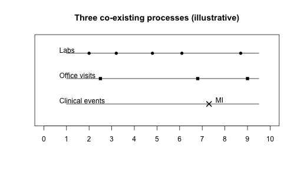

``` r
## Maturity: draft
```



``` r
library(fluxCore)

# Best practice: declare the model time unit up front.
# We do this in a shared "context" object (ctx), which is passed into the Engine
# at run-time. Downstream packages can use ctx$time$unit to label and sanity-check
# time-related quantities.
ctx <- fluxCore::set_time_unit(ctx = list(), unit = "years")
#> Error: 'set_time_unit' is not an exported object from 'namespace:fluxCore'

# fluxCore schemas are named lists of variable descriptors.
# Each variable has at least:
#   - default: baseline value when init does not provide it
#   - type: used by downstream summary/validation code
# and may also include:
#   - coerce / validate
#   - blocks: panel membership (e.g., BP, lipids)
schema <- list(
  age = list(
    type     = "continuous",
    default  = 50,
    coerce   = as.numeric,
    validate = function(x) length(x) == 1L && (is.na(x) || (is.finite(x) && x >= 0))
  ),

  sbp = list(
    type     = "continuous",
    default  = 120,
    coerce   = as.numeric,
    validate = function(x) length(x) == 1L && (is.na(x) || is.finite(x)),
    blocks   = "bp"
  ),
  dbp = list(
    type     = "continuous",
    default  = 80,
    coerce   = as.numeric,
    validate = function(x) length(x) == 1L && (is.na(x) || is.finite(x)),
    blocks   = "bp"
  ),

  ldl = list(
    type     = "continuous",
    default  = 120,
    coerce   = as.numeric,
    validate = function(x) length(x) == 1L && (is.na(x) || is.finite(x)),
    blocks   = "lipids"
  ),
  hdl = list(
    type     = "continuous",
    default  = 50,
    coerce   = as.numeric,
    validate = function(x) length(x) == 1L && (is.na(x) || is.finite(x)),
    blocks   = "lipids"
  ),

  diabetes = list(
    type     = "binary",
    levels   = c("0","1"),
    default  = FALSE,
    coerce   = as.logical,
    validate = function(x) length(x) == 1L && (is.na(x) || is.logical(x))
  ),
  smoker = list(
    type     = "binary",
    levels   = c("0","1"),
    default  = FALSE,
    coerce   = as.logical,
    validate = function(x) length(x) == 1L && (is.na(x) || is.logical(x))
  )
)

# Optional: let Core check that this looks like a schema.
schema_validate(schema)

# Show the shape, without printing a wall of text.
str(schema, max.level = 1)
#> List of 7
#>  $ age     :List of 4
#>  $ sbp     :List of 5
#>  $ dbp     :List of 5
#>  $ ldl     :List of 5
#>  $ hdl     :List of 5
#>  $ diabetes:List of 5
#>  $ smoker  :List of 5
schema$age
#> $type
#> [1] "continuous"
#> 
#> $default
#> [1] 50
#> 
#> $coerce
#> function (x, ...)  .Primitive("as.double")
#> 
#> $validate
#> function (x) 
#> length(x) == 1L && (is.na(x) || (is.finite(x) && x >= 0))
#> <environment: 0x13e2678d0>
schema$ldl
#> $type
#> [1] "continuous"
#> 
#> $default
#> [1] 120
#> 
#> $coerce
#> function (x, ...)  .Primitive("as.double")
#> 
#> $validate
#> function (x) 
#> length(x) == 1L && (is.na(x) || is.finite(x))
#> <environment: 0x13e2678d0>
#> 
#> $blocks
#> [1] "lipids"
```

``` r
# We start by defining how frequently each process proposes events.
# Everything below is intentionally toy and tuned only for readable output.

# Helper: exponential waiting time given a rate per year
rexp_dt <- function(rate_per_year) stats::rexp(1, rate = rate_per_year)

# --- (a) Process rates / hazards (toy, NOT clinical) ---
# Labs are a faster measurement process; office visits are a medium process.
rate_labs   <- function(state) 3.0
rate_office <- function(state) 1.0

# Clinical events are modeled as a slower process.
# These hazards are intentionally tiny here so we get readable trajectories.
hazard_mi <- function(state) {
  lin <- -14.8 + 0.03 * (state$age - 50) + 0.010 * (state$sbp - 120) + 0.008 * (state$ldl - 120) +
    0.7 * as.integer(state$diabetes) + 0.6 * as.integer(state$smoker)
  exp(lin)
}
hazard_stroke <- function(state) {
  lin <- -15.1 + 0.03 * (state$age - 50) + 0.012 * (state$sbp - 120) + 0.004 * (state$ldl - 120) +
    0.6 * as.integer(state$diabetes) + 0.4 * as.integer(state$smoker)
  exp(lin)
}
hazard_hosp <- function(state) {
  lin <- -15.0 + 0.02 * (state$age - 50) + 0.006 * (state$sbp - 120) + 0.004 * (state$ldl - 120)
  exp(lin)
}
hazard_death <- function(state) {
  lin <- -15.6 + 0.04 * (state$age - 50) + 0.003 * (state$sbp - 120) + 0.002 * (state$ldl - 120)
  exp(lin)
}

```

``` r
propose_events <- function(entity, ctx = NULL, process_ids = NULL, current_proposals = NULL) {
  t0 <- entity$last_time
  s  <- entity$as_list(c("age","sbp","dbp","ldl","hdl","diabetes","smoker"))

  proposals <- list()

  pid_labs <- "01_labs"
  if (is.null(process_ids) || pid_labs %in% process_ids) {
    proposals[[pid_labs]] <- list(
      process_id = pid_labs,
      time_next  = t0 + rexp_dt(rate_labs(s)),
      event_type = "LAB"
    )
  }

  pid_office <- "02_office"
  if (is.null(process_ids) || pid_office %in% process_ids) {
    proposals[[pid_office]] <- list(
      process_id = pid_office,
      time_next  = t0 + rexp_dt(rate_office(s)),
      event_type = "OFFICE"
    )
  }

  pid_clin <- "03_clinical"
  if (is.null(process_ids) || pid_clin %in% process_ids) {
    t_mi   <- rexp_dt(hazard_mi(s))
    t_st   <- rexp_dt(hazard_stroke(s))
    t_hosp <- rexp_dt(hazard_hosp(s))
    t_dx   <- rexp_dt(hazard_death(s))

    dt <- min(t_mi, t_st, t_hosp, t_dx)
    et <- c("MI","STROKE","HOSP","DEATH")[which.min(c(t_mi, t_st, t_hosp, t_dx))]

    proposals[[pid_clin]] <- list(
      process_id = pid_clin,
      time_next  = t0 + dt,
      event_type = et
    )
  }

  proposals
}

```

``` r
transition <- function(entity, event, ctx = NULL) {
  # Age updates deterministically from the model time unit (years in this vignette).
  dt <- as.numeric(event$time_next - entity$last_time)

  s <- entity$as_list(c("age","sbp","dbp","ldl","hdl","diabetes","smoker"))

  changes <- list(age = s$age + dt)

  # Event-conditional updates. (Toy measurement dynamics, not clinical.)
  if (identical(event$event_type, "LAB")) {
    changes$ldl <- max(30,  s$ldl + stats::rnorm(1, mean = 0, sd = 6))
    changes$hdl <- max(10,  s$hdl + stats::rnorm(1, mean = 0, sd = 3))
  }

  if (identical(event$event_type, "OFFICE")) {
    changes$sbp <- max(60,  s$sbp + stats::rnorm(1, mean = 0, sd = 5))
    changes$dbp <- max(40,  s$dbp + stats::rnorm(1, mean = 0, sd = 3))
  }

  changes
}

```

``` r
stop <- function(entity, event, ctx = NULL) {
  identical(event$event_type, "DEATH")
}

```

``` r
observe <- function(entity, event, ctx = NULL) {
  s <- entity$as_list(c("age","sbp","dbp","ldl","hdl","diabetes","smoker"))
  data.frame(
    time       = entity$last_time,
    process_id = event$process_id,
    event_type = event$event_type,
    age        = s$age,
    sbp        = s$sbp,
    dbp        = s$dbp,
    ldl        = s$ldl,
    hdl        = s$hdl,
    diabetes   = s$diabetes,
    smoker     = s$smoker
  )
}

```

``` r
refresh_rules <- function(entity, last_event, changes, ctx = NULL) {
  "ALL"
}

```

``` r
bundle <- list(
  propose_events = propose_events,
  transition     = transition,
  stop           = stop,
  observe        = observe,
  refresh_rules  = refresh_rules
)

names(bundle)
#> [1] "propose_events" "transition"     "stop"           "observe"       
#> [5] "refresh_rules"
```

``` r
# The registry maps a model "name" to a function that can build its ModelBundle.
# Here, the builder simply returns the bundle we already constructed.
prov <- PackageProvider$new(
  registry = list(
    # Minimal builder: ignore args and return the bundle we built above.
    ascvd_toy = function(...) bundle
  )
)

eng <- Engine$new(
  provider   = prov,
  model_spec = list(name = "ascvd_toy"),
  ctx        = ctx
)
#> Error: ModelBundle must define `$time_spec` as a fluxCore `time_spec` object.
```

``` r
entity_low_risk <- list(
  id = "P1",
  age = 45,
  sbp = 118,
  dbp = 76,
  ldl = 105,
  hdl = 58,
  diabetes = FALSE,
  smoker = FALSE
)

entity_high_risk <- list(
  id = "P2",
  age = 68,
  sbp = 152,
  dbp = 92,
  ldl = 165,
  hdl = 38,
  diabetes = TRUE,
  smoker = TRUE
)

entities <- list(entity_low_risk, entity_high_risk)

```

``` r
# Two entities, simulated for 2 years.
# We'll cap max_events so output stays readable even if a rate is high.
max_events <- 200
horizon_years <- 2

# P1
pid1 <- entity_low_risk$id
init1 <- entity_low_risk; init1$id <- NULL
p1 <- fluxCore::Entity$new(
  init = init1,
  schema = schema,
  entity_type = "entity",
  time0 = 0,
  event_type0 = "init"
)
out1 <- eng$run(p1, max_events = max_events, max_time = horizon_years, return_observations = TRUE, ctx = ctx)
#> Error: object 'eng' not found
traj1 <- out1$observations
#> Error: object 'out1' not found
traj1$entity_id <- pid1
#> Error: object 'traj1' not found

# P2
pid2 <- entity_high_risk$id
init2 <- entity_high_risk; init2$id <- NULL
p2 <- fluxCore::Entity$new(
  init = init2,
  schema = schema,
  entity_type = "entity",
  time0 = 0,
  event_type0 = "init"
)
out2 <- eng$run(p2, max_events = max_events, max_time = horizon_years, return_observations = TRUE, ctx = ctx)
#> Error: object 'eng' not found
traj2 <- out2$observations
#> Error: object 'out2' not found
traj2$entity_id <- pid2
#> Error: object 'traj2' not found

traj1
#> Error: object 'traj1' not found
traj2
#> Error: object 'traj2' not found
```

``` r
summarize_events <- function(traj) {
  as.data.frame(table(traj$event_type), stringsAsFactors = FALSE)
}

list(
  P1_events = summarize_events(traj1),
  P2_events = summarize_events(traj2)
)
#> Error: object 'traj1' not found
```

