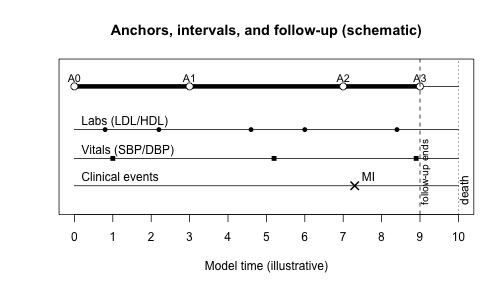

``` r
## Maturity: draft
```



``` r
ehr <- fluxASCVD:::ascvd_make_example_ehr(n_entities = 50, seed = 123)

```


Table: Patients (one row per entity)

| entity_id|index_date |sex |
|---------:|:----------|:---|
|         1|2019-02-19 |M   |
|         2|2019-04-08 |F   |


Table: Labs (LDL/HDL) for two example entities

| entity_id|obs_date   | ldl| hdl|
|---------:|:----------|---:|---:|
|         1|2019-08-02 | 138|  59|
|         1|2022-03-03 | 141|  71|
|         1|2024-04-03 | 131|  45|
|         2|2024-09-09 | 112|  60|
|         2|2027-02-06 | 113|  47|


Table: Vitals (SBP/DBP) for two example entities

| entity_id|obs_date   | sbp| dbp|
|---------:|:----------|---:|---:|
|         1|2019-05-05 | 138|  85|
|         1|2020-01-27 | 125|  88|
|         1|2021-01-21 | 131|  92|
|         1|2021-09-05 | 132|  89|
|         1|2022-07-03 | 123|  84|
|         2|2019-04-09 | 136|  90|
|         2|2020-05-11 | 124|  80|
|         2|2021-12-13 | 128|  86|
|         2|2023-11-30 | 135|  86|
|         2|2025-04-19 | 137|  92|
|         2|2026-06-29 | 116|  82|
|         2|2027-03-22 | 131|  88|


Table: Clinical events for two example entities

|    | entity_id|event_date |event           |
|:---|---------:|:----------|:---------------|
|116 |         1|2022-04-02 |death           |
|1   |         1|2023-04-04 |office_visit    |
|2   |         2|2021-03-04 |hospitalization |


Table: Medications for two example entities

| entity_id|start_date |medication    |
|---------:|:----------|:-------------|
|         1|2021-02-06 |statin        |
|         2|2019-04-27 |ace_inhibitor |
|         2|2021-10-08 |beta_blocker  |


``` r
ctx <- fluxCore::set_time_unit(
  ctx = list(),
  unit = "weeks"
)

example_ids <- head(ehr$entities$entity_id, 2)

```

``` r
library(fluxPrepare)

```

``` r
obs <- prepare_observations(
  tables = list(
    labs   = ehr$labs,
    vitals = ehr$vitals
  ),
  specs = list(
    labs = list(
      id_col   = "entity_id",
      time_col = "obs_date",
      vars     = c("ldl", "hdl"),
      group    = "labs"
    ),
    vitals = list(
      id_col   = "entity_id",
      time_col = "obs_date",
      vars     = c("sbp", "dbp"),
      group    = "vitals"
    )
  ),
  ctx = ctx
)

obs |>
  dplyr::filter(entity_id %in% example_ids) |>
  head(10) |>
  knitr::kable()
```


|entity_id |     time|group  | ldl| hdl| sbp| dbp|source_table |
|:---------|--------:|:------|---:|---:|---:|---:|:------------|
|1         | 2574.429|vitals |  NA|  NA| 138|  85|vitals       |
|1         | 2587.143|labs   | 138|  59|  NA|  NA|labs         |
|1         | 2612.571|vitals |  NA|  NA| 125|  88|vitals       |
|1         | 2664.000|vitals |  NA|  NA| 131|  92|vitals       |
|1         | 2696.429|vitals |  NA|  NA| 132|  89|vitals       |
|1         | 2722.000|labs   | 141|  71|  NA|  NA|labs         |
|1         | 2739.429|vitals |  NA|  NA| 123|  84|vitals       |
|1         | 2830.857|labs   | 131|  45|  NA|  NA|labs         |
|2         | 2570.714|vitals |  NA|  NA| 136|  90|vitals       |
|2         | 2627.571|vitals |  NA|  NA| 124|  80|vitals       |


``` r
events <- prepare_events(
  events    = ehr$events,
  id_col    = "entity_id",
  time_col  = "event_date",
  type_col  = "event",
  ctx       = ctx
)

events |>
  dplyr::filter(entity_id %in% example_ids) |>
  head(10) |>
  knitr::kable()
```


|entity_id |     time|event_type      |source_table |
|:---------|--------:|:---------------|:------------|
|1         | 2726.286|death           |NA           |
|1         | 2778.714|office_visit    |NA           |
|2         | 2670.000|hospitalization |NA           |


``` r
set.seed(1)

splits_raw <- data.frame(
  entity_id = ehr$entities$entity_id,
  split = sample(
    c("train", "test", "validation"),
    size = nrow(ehr$entities),
    replace = TRUE,
    prob = c(0.70, 0.15, 0.15)
  ),
  stringsAsFactors = FALSE
)

splits <- prepare_splits(splits_raw)

splits |>
  head(6) |>
  knitr::kable()
```


|entity_id |split |
|:---------|:-----|
|1         |train |
|2         |train |
|3         |train |
|4         |test  |
|5         |train |
|6         |test  |


``` r
fu_obs <- obs |>
  dplyr::group_by(entity_id) |>
  dplyr::summarize(t_obs_min = min(time), .groups = "drop")

fu_evt <- events |>
  dplyr::group_by(entity_id) |>
  dplyr::summarize(t_evt_min = min(time), .groups = "drop")

fu_death <- events |>
  dplyr::filter(event_type == "death") |>
  dplyr::group_by(entity_id) |>
  dplyr::summarize(death_time = min(time), .groups = "drop")

followup <- splits |>
  dplyr::select(entity_id) |>
  dplyr::left_join(fu_obs, by = "entity_id") |>
  dplyr::left_join(fu_evt, by = "entity_id") |>
  dplyr::mutate(
    followup_start = pmin(t_obs_min, t_evt_min, na.rm = TRUE),
    followup_end   = followup_start + (9 * 52)
  ) |>
  dplyr::left_join(fu_death, by = "entity_id") |>
  dplyr::select(entity_id, followup_start, followup_end, death_time)

followup |>
  dplyr::filter(entity_id %in% example_ids) |>
  knitr::kable()
```


|entity_id | followup_start| followup_end| death_time|
|:---------|--------------:|------------:|----------:|
|1         |       2574.429|     3042.429|   2726.286|
|2         |       2570.714|     3038.714|         NA|


``` r
event_settings <- spec_event_process(
  event_types     = c("MI", "stroke", "death"),
  split_on_groups = "vitals",
  segment_on_vars = "sbp",
  segment_rules   = segment_bins(sbp = c(-Inf, 120, 140, Inf)),
  candidate_times = "groups_or_vars",
  t0_strategy     = "followup_start",
  death_col       = "death_time"
)

event_settings
#> $task
#> [1] "event_process"
#> 
#> $name
#> NULL
#> 
#> $event_types
#> [1] "MI"     "stroke" "death" 
#> 
#> $split_on_groups
#> [1] "vitals"
#> 
#> $segment_on_vars
#> [1] "sbp"
#> 
#> $segment_rules
#> $bins
#> $bins$sbp
#> [1] -Inf  120  140  Inf
#> 
#> 
#> attr(,"class")
#> [1] "segment_rules"
#> 
#> $candidate_times
#> [1] "groups_or_vars"
#> 
#> $min_dt
#> [1] 0
#> 
#> $t0_strategy
#> [1] "followup_start"
#> 
#> $fixed_t0
#> [1] 0
#> 
#> $fu_start_col
#> [1] "followup_start"
#> 
#> $fu_end_col
#> [1] "followup_end"
#> 
#> $death_col
#> [1] "death_time"
#> 
#> attr(,"class")
#> [1] "spec_event_process" "flux_spec"
```

``` r
ttv_major <- build_ttv_event_process(
  events       = events,
  observations = obs,
  splits       = splits,
  spec         = event_settings,
  followup     = followup,
  ctx          = ctx
)

ttv_major |>
  dplyr::filter(entity_id %in% example_ids) |>
  head(12) |>
  knitr::kable()
```


|entity_id |split |       t0|       t1|    deltat|event_occurred |event_type | censoring_time|
|:---------|:-----|--------:|--------:|---------:|:--------------|:----------|--------------:|
|1         |train | 2574.429| 2726.286| 151.85714|TRUE           |death      |       2726.286|
|2         |train | 2570.714| 2947.571| 376.85714|FALSE          |NA         |       3038.714|
|2         |train | 2947.571| 2985.571|  38.00000|FALSE          |NA         |       3038.714|
|2         |train | 2985.571| 3038.714|  53.14286|FALSE          |NA         |       3038.714|


``` r
anchors <- ttv_major |>
  dplyr::select(entity_id, t0)

state_t0 <- reconstruct_state_at(
  anchors      = anchors,
  observations = obs,
  vars         = c("sbp", "dbp", "ldl", "hdl"),
  lookback     = 52,
  staleness    = 52
)

ttv_major_cov <- ttv_major |>
  dplyr::left_join(
    state_t0 |>
      dplyr::select(entity_id, t0, sbp, dbp, ldl, hdl),
    by = c("entity_id", "t0")
  )

ttv_major_cov |>
  dplyr::filter(entity_id %in% example_ids) |>
  head(8) |>
  knitr::kable()
```


|entity_id |split |       t0|       t1|    deltat|event_occurred |event_type | censoring_time| sbp| dbp| ldl| hdl|
|:---------|:-----|--------:|--------:|---------:|:--------------|:----------|--------------:|---:|---:|---:|---:|
|1         |train | 2574.429| 2726.286| 151.85714|TRUE           |death      |       2726.286| 138|  85|  NA|  NA|
|2         |train | 2570.714| 2947.571| 376.85714|FALSE          |NA         |       3038.714| 136|  90|  NA|  NA|
|2         |train | 2947.571| 2985.571|  38.00000|FALSE          |NA         |       3038.714| 116|  82|  NA|  NA|
|2         |train | 2985.571| 3038.714|  53.14286|FALSE          |NA         |       3038.714| 131|  88| 113|  47|


``` r
ttv_bp <- build_ttv_state(
  observations   = obs,
  splits         = splits,
  outcome_group  = "vitals",
  outcome_vars   = c("sbp", "dbp"),
  predictor_vars = c("sbp", "dbp", "ldl", "hdl"),
  followup       = followup,
  death_col      = "death_time",
  lookback       = 52,    ### these are defined in the 
  staleness      = 52,    ### model's time_unit (weeks)
  row_policy     = "drop_incomplete"
)

ttv_bp |>
  dplyr::filter(entity_id %in% example_ids) |>
  head(10) |>
  knitr::kable()
```


|entity_id |split |       t0|       t1|    deltat|censored |end_type | sbp| dbp| ldl| hdl| .time_sbp|.prov_sbp | .time_dbp|.prov_dbp | .time_ldl|.prov_ldl       | .time_hdl|.prov_hdl       | sbp.1| dbp.1|
|:---------|:-----|--------:|--------:|---------:|:--------|:--------|---:|---:|---:|---:|---------:|:---------|---------:|:---------|---------:|:---------------|---------:|:---------------|-----:|-----:|
|1         |train | 2574.429| 2612.571|  38.14286|FALSE    |observed | 138|  85|  NA|  NA|  2574.429|observed  |  2574.429|observed  |        NA|missing         |        NA|missing         |   125|    88|
|1         |train | 2612.571| 2664.000|  51.42857|FALSE    |observed | 125|  88| 138|  59|  2612.571|observed  |  2612.571|observed  |  2587.143|carried_forward |  2587.143|carried_forward |   131|    92|
|1         |train | 2664.000| 2696.429|  32.42857|FALSE    |observed | 131|  92|  NA|  NA|  2664.000|observed  |  2664.000|observed  |        NA|missing         |        NA|missing         |   132|    89|
|1         |train | 2696.429| 2726.286|  29.85714|TRUE     |death    | 132|  89|  NA|  NA|  2696.429|observed  |  2696.429|observed  |        NA|missing         |        NA|missing         |    NA|    NA|
|2         |train | 2570.714| 2627.571|  56.85714|FALSE    |observed | 136|  90|  NA|  NA|  2570.714|observed  |  2570.714|observed  |        NA|missing         |        NA|missing         |   124|    80|
|2         |train | 2627.571| 2710.571|  83.00000|FALSE    |observed | 124|  80|  NA|  NA|  2627.571|observed  |  2627.571|observed  |        NA|missing         |        NA|missing         |   128|    86|
|2         |train | 2710.571| 2813.000| 102.42857|FALSE    |observed | 128|  86|  NA|  NA|  2710.571|observed  |  2710.571|observed  |        NA|missing         |        NA|missing         |   135|    86|
|2         |train | 2813.000| 2885.286|  72.28571|FALSE    |observed | 135|  86|  NA|  NA|  2813.000|observed  |  2813.000|observed  |        NA|missing         |        NA|missing         |   137|    92|
|2         |train | 2885.286| 2947.571|  62.28571|FALSE    |observed | 137|  92| 112|  60|  2885.286|observed  |  2885.286|observed  |  2853.571|carried_forward |  2853.571|carried_forward |   116|    82|
|2         |train | 2947.571| 2985.571|  38.00000|FALSE    |observed | 116|  82|  NA|  NA|  2947.571|observed  |  2947.571|observed  |        NA|missing         |        NA|missing         |   131|    88|


