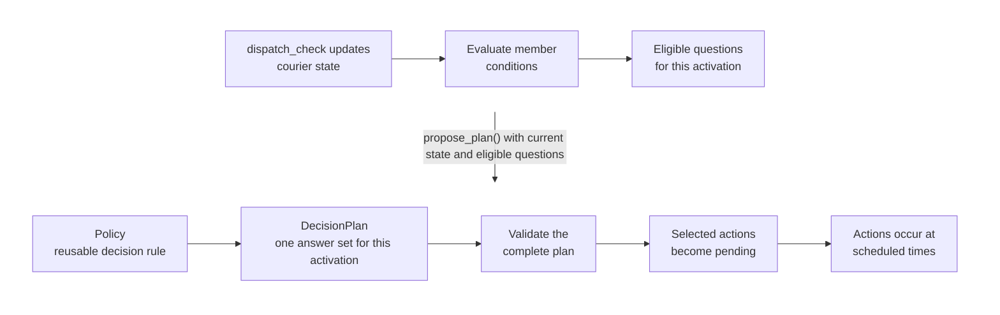

```{r setup, include=FALSE}
knitr::opts_chunk$set(collapse = TRUE, comment = "#>")
suppressPackageStartupMessages({
  library(fluxCore)
  library(dplyr)
  library(knitr)
})
```

In [Tutorial 02](02_cohort_forecast.md), couriers followed the same operational
rules: dispatch offers arrived, deliveries completed, and batteries drained.
Here we add choices. A dispatcher may accept or decline an offer, while a
safety rule may reduce a low-battery courier's load.

In flux, a **decision point** connects an event to a possible choice. Its
optional **condition** is a yes-or-no rule that determines whether the choice
is relevant in the courier's current state. For example, every
`dispatch_check` event might open the dispatcher's accept-or-decline decision,
while the battery-safety decision opens only when the courier's battery is low.

When the triggering event occurs and the condition passes, fluxCore consults a
**policy**: R code that represents how the choice is made. A policy might
encode a fixed protocol, an expert rule, a fitted algorithm, or an intervention
being studied.

The policy may select an allowed **action**. A selected action becomes a
separate event on the irregular-time calendar. Selection itself does not change
state; an **action handler** changes state only if the action event is later
realized by the engine.

By the end of this tutorial, you will be able to:

- declare an ordinary decision point and write its policy;
- follow a selected action as fluxCore holds it pending, realizes it as an
  event, and applies its handler's state effect;
- handle delayed actions, including a repeated decision while an earlier action
  is waiting;
- use two independent decisions triggered by the same event occurrence; and
- coordinate several eligible decisions in one grouped policy consultation.

## Setup: keeping the delivery scenario predictable

```{r}
library(fluxCore)
library(dplyr)
library(knitr)
source("tutorials/model/urban_delivery.R")
source("tutorials/model/urban_delivery_decisions.R")
```

The shared [urban-delivery script](model/urban_delivery.R) defines
`delivery_schema()`, which describes courier state, and `delivery_bundle()`,
which supplies the functions that propose events, update state, and stop a run.
Tutorial 02 used that bundle's full stochastic delivery process.

This tutorial uses a controlled version of the same model so that the tables
are easy to follow: dispatch checks occur at chosen hours, an offer can be open
or closed, and the shift still ends at a fixed time. The
[decision-scenario helper](model/urban_delivery_decisions.R) contains only that
repeatable setup. It also provides `fresh_courier()`, which creates a new
courier with the standard starting state and an empty event history for each
example. Treat these as prebuilt tutorial fixtures: you do not need to write or
understand their implementation to follow the decision examples. Neither
helper changes the decision contracts taught below.

## One dispatch decision: selected now, carried out later

Suppose an offer arrives at hour 1. The transition marks the offer as assigned
and records its payload. Then fluxCore reaches the `dispatch_response` decision
point and consults the policy. For this first example, the policy always selects
a decline action for hour 1.5.

An action handler is an ordinary R function that receives the courier and the
realized action event, then returns any state values to update. We first declare
the available choice, its allowed actions, and the handler for each action. We
then add that decision point to the courier schema.

```{r}
dispatch_handlers <- list(
  confirm_dispatch = function(entity, event) {
    list(dispatch_mode = "in_transit")
  },
  decline_dispatch = function(entity, event) {
    list(dispatch_mode = "idle", payload_kg = 0)
  }
)

dispatch_response_dp <- DecisionPoint(
  id = "dispatch_response",
  trigger = "dispatch_check",
  allowed_actions = c("confirm_dispatch", "decline_dispatch"),
  action_handlers = dispatch_handlers,
  label = "Respond to an open delivery offer"
)

dispatch_schema <- set_schema(
  vars = delivery_schema(),
  time_spec = time_spec(unit = "hours"),
  decision_points = list(dispatch_response_dp)
)

str(object = dispatch_schema, max.level = 2)
dispatch_schema$decision_points[[1]]
```

The compact schema output confirms that the sourced delivery schema contributed
four state variables. The assembled schema also declares an hourly model clock
and the `dispatch_response` decision point.

The declaration says which choices are possible, but it does not make a choice.
That is the policy's job. Whenever this decision point is reached, the simple
policy below selects `decline_dispatch` for half an hour later.

```{r}
decline_policy <- function(decision_point, entity) {
  ActionEvent(
    action_type = "decline_dispatch",
    time_next = entity$last_time + 0.5,
    metadata = list(reason = "tutorial demonstration")
  )
}
```

Finally, `load_model()` connects the assembled schema, the controlled delivery
event model, and the policy into an object that can run a courier simulation.

```{r}
dispatch_model <- load_model(
  schema = dispatch_schema,
  bundle = controlled_delivery_bundle(offer_times = 1),
  policy = decline_policy,
  trajectory = list(detail = "summary")
)
```

First stop immediately after the offer event. This lets us see the selected
future action before it has happened.

```{r}
after_offer <- dispatch_model$run(
  entity = fresh_courier(id = "courier_after_offer"),
  max_events = 1
)

selected <- after_offer$trajectory_records[[1]]$selected_action

data.frame(
  offer_time = after_offer$trajectory_records[[1]]$t,
  state_after_offer = after_offer$entity$current$dispatch_mode,
  selected_action = selected$action_type,
  selected_for_time = selected$time_next,
  matching_action_type_in_history = selected$action_type %in%
    after_offer$events$event_type
) |>
  t() |>
  kable(col.names = "Value")
```

The policy has **selected** `decline_dispatch`, and fluxCore has validated the
choice. It now holds the action as **pending**: selected and scheduled, but not
yet occurred. Each decision point has at most one place for such a waiting
action. The action is absent from event history because selection is not the
same as realization.

Rerun the same scenario from a fresh courier, this time allowing both the offer
and the selected action to occur.

```{r}
after_action <- dispatch_model$run(
  entity = fresh_courier(id = "courier_after_action"),
  max_events = 2,
  return_observations = TRUE
)

after_action$observations |>
  select(time, event_type, dispatch_mode, payload_kg) |>
  t() |>
  kable(col.names = c("Offer event", "Action event"))
```

The decision-to-action sequence is:

| Time | What happens | Where it is recorded |
|---:|---|---|
| 1 | `dispatch_check` occurs and its transition opens the offer | Event history and observations |
| 1 | The policy selects `decline_dispatch`; fluxCore holds it pending for hour 1.5 | Decision trajectory |
| 1.5 | The pending action becomes the next event on the timeline | Event history and observations |
| 1.5 | Its handler returns the courier to `idle` and clears the payload | Updated state |

The trajectory row describes the decision at hour 1. Its `state_before` and
`state_after` bracket the triggering `dispatch_check` transition; they do not
bracket the later action handler.

```{r}
trajectory_table(
  records = after_offer$trajectory_records,
  vars = c("dispatch_mode", "payload_kg")
) |>
  select(
    t, decision_point_id, trigger_event, selected_action,
    dispatch_mode_before, dispatch_mode_after,
    payload_kg_before, payload_kg_after
  ) |>
  t() |>
  kable(col.names = "Value")
```

`selected_action` records the policy's choice; it is not a promise that the
choice was retained or realized. Event history records what actually occurred.
The action type is enough to connect the records in this small example. Models
that can schedule several similar actions may need their own identifiers for
more detailed lineage.

## Conditions decide whether policy is consulted

A trigger answers “did an offer event occur?” A `condition` answers a separate
question after the event's transition has updated state: “does this courier
require this decision now?” Here the policy is consulted only when battery is
below 25%.

```{r}
critical_battery_dp <- DecisionPoint(
  id = "critical_dispatch_response",
  trigger = "dispatch_check",
  condition = function(entity) entity$current$battery_pct < 25,
  allowed_actions = "decline_dispatch",
  action_handlers = list(
    decline_dispatch = dispatch_handlers$decline_dispatch
  ),
  audit = TRUE # Record visits even when the condition is false.
)
```

To add this decision point to the model, we redefine the schema and reload the
model. The previously defined `decline_policy()` already selects the allowed
`decline_dispatch` action, so we can reuse it.

```{r}
critical_schema <- set_schema(
  vars = delivery_schema(),
  time_spec = time_spec(unit = "hours"),
  decision_points = list(critical_battery_dp)
)

critical_model <- load_model(
  schema = critical_schema,
  bundle = controlled_delivery_bundle(offer_times = 1),
  policy = decline_policy,
  trajectory = list(detail = "summary")
)
```

We now define a function that runs the model with different starting values of
`battery_pct`, then apply it under two scenarios.

```{r}
condition_run <- function(id, battery) {
  out <- critical_model$run(
    entity = fresh_courier(id = id, battery_pct = battery),
    max_events = 1
  )
  tab <- trajectory_table(
    records = out$trajectory_records,
    vars = "battery_pct"
  )
  tab$starting_battery <- battery
  tab
}

bind_rows(
  condition_run(id = "healthy_battery", battery = 80),
  condition_run(id = "low_battery", battery = 15)
) |>
  select(starting_battery, condition_met, selected_action) |>
  t() |>
  kable(col.names = c("Healthy battery", "Low battery"))
```

For the low-battery courier, `condition_met = TRUE`: fluxCore calls the policy,
which selects `decline_dispatch`. For the healthy courier, the condition is
false, so the policy is not called and no action is selected. Because
`audit = TRUE`, that skipped visit still appears in the table; without auditing,
it would produce no decision row. If a decision point has no condition,
fluxCore treats it as eligible whenever its trigger fires.

## Repeated decisions while an action is waiting

The event model continually proposes candidates such as the next dispatch
check. Those predictions may be recalculated as a run progresses. fluxCore
keeps a policy-selected pending action separately, so refreshing ordinary event
proposals does not erase an action that is still waiting.

This matters when two offers arrive at hours 1 and 2, while each policy call
selects a decline three hours later. The first and second selections are for
hours 4 and 5. A decision point can hold only one pending action, so
`on_pending_action` tells fluxCore what to do when the second selection arrives.

These integer-hour timings are deliberately schematic. They are not intended
to represent the pace of offers and responses in real urban food delivery;
they simply make the two selections and their conflict easy to distinguish.

First define the delayed policy used in this example. It always schedules
`decline_dispatch` three model hours after the triggering offer.

```{r}
delayed_decline_policy <- function(decision_point, entity) {
  ActionEvent(
    action_type = "decline_dispatch",
    time_next = entity$last_time + 3
  )
}
```

For a direct example, set `on_pending_action = "keep"`. The earlier
`dispatch_response_dp` uses the default mode, `warn`, so it cannot be reused
unchanged here. We do reuse its decline action handler.

```{r}
keep_pending_dp <- DecisionPoint(
  id = "dispatch_response",
  trigger = "dispatch_check",
  allowed_actions = "decline_dispatch",
  action_handlers = list(
    decline_dispatch = dispatch_handlers$decline_dispatch
  ),
  on_pending_action = "keep"
)
```

Add this decision point to a schema and load a model with two scheduled offers.

```{r}
keep_pending_schema <- set_schema(
  vars = delivery_schema(),
  time_spec = time_spec(unit = "hours"),
  decision_points = list(keep_pending_dp)
)

keep_pending_model <- load_model(
  schema = keep_pending_schema,
  bundle = controlled_delivery_bundle(offer_times = c(1, 2)),
  policy = delayed_decline_policy,
  trajectory = list(detail = "summary")
)
```

Now run one courier. The decision records show both policy selections: the
first action is scheduled for hour 4 and the second for hour 5.

```{r}
keep_pending_out <- keep_pending_model$run(
  entity = fresh_courier(id = "courier_keep"),
  max_events = 10
)

pending_records <- keep_pending_out$trajectory_records
first_offer <- pending_records[[1]]
second_offer <- pending_records[[2]]

data.frame(
  decision_time = c(first_offer$t, second_offer$t),
  selected_for_time = c(
    first_offer$selected_action$time_next,
    second_offer$selected_action$time_next
  )
) |>
  t() |>
  kable(col.names = c("First offer", "Second offer"))
```

Because the mode is `keep`, only the first waiting action is retained. Event
history therefore contains `decline_dispatch` at hour 4, not hour 5.

```{r}
keep_pending_out$events |>
  filter(event_type %in% c("dispatch_check", "decline_dispatch")) |>
  select(time, event_type) |>
  kable()
```

The modes make the modeler's intent explicit:

| Mode | What the second selection does |
|---|---|
| `keep` | Retains the waiting hour-4 action and discards the new hour-5 selection |
| `replace` | Silently replaces the hour-4 action with the hour-5 action |
| `warn` | Makes the same replacement and reports a warning |
| `error` | Stops rather than choosing between the two actions |

The direct run demonstrates `keep`. Changing only `on_pending_action` would
make `replace` or `warn` retain the hour-5 action instead; `warn` would also
report the replacement. With `error`, the run stops when the second selection
conflicts with the waiting action. The second `dispatch_check` and its state
transition have already occurred at that point and are not undone.

## Two independent decisions triggered by one event

Now give a low-battery courier two distinct questions at the same
`dispatch_check`:

- should the offer be confirmed? and
- should the payload be reduced for safety?

These remain **ordinary** decision points. The same event occurrence opens
both, but fluxCore checks each condition separately, calls the policy once for
each eligible decision, and keeps a separate pending action for each one.

```{r}
shed_payload_handler <- function(entity, event) {
  list(payload_kg = entity$current$payload_kg / 2)
}

ordinary_dispatch_response <- DecisionPoint(
  id = "dispatch_response",
  trigger = "dispatch_check",
  condition = function(entity) entity$current$dispatch_mode == "assigned",
  allowed_actions = "confirm_dispatch",
  action_handlers = list(
    confirm_dispatch = dispatch_handlers$confirm_dispatch
  ),
  on_pending_action = "replace"
)

ordinary_battery_safety <- DecisionPoint(
  id = "battery_safety",
  trigger = "dispatch_check",
  condition = function(entity) {
    entity$current$dispatch_mode == "assigned" &&
      entity$current$battery_pct < 30
  },
  allowed_actions = "shed_payload",
  action_handlers = list(
    shed_payload = shed_payload_handler
  ),
  on_pending_action = "replace"
)
```

Add both independent decision points to the schema.

```{r}
ordinary_shared_schema <- set_schema(
  vars = delivery_schema(),
  time_spec = time_spec(unit = "hours"),
  decision_points = list(
    ordinary_dispatch_response,
    ordinary_battery_safety
  )
)
```

An ordinary policy is called once for each eligible decision. This policy uses
the decision-point id to select the appropriate action.

```{r}
ordinary_shared_policy <- function(decision_point, entity) {
  if (decision_point$id == "battery_safety") {
    ActionEvent(
      action_type = "shed_payload",
      time_next = entity$last_time + 0.25
    )
  } else {
    ActionEvent(
      action_type = "confirm_dispatch",
      time_next = entity$last_time + 0.5
    )
  }
}
```

Load the model and run one low-battery courier. Both conditions are true after
the `dispatch_check`, so the policy is called twice.

```{r}
ordinary_shared_model <- load_model(
  schema = ordinary_shared_schema,
  bundle = controlled_delivery_bundle(
    offer_times = 1,
    offered_payload_kg = 4
  ),
  policy = ordinary_shared_policy,
  trajectory = list(detail = "summary")
)

ordinary_shared_out <- ordinary_shared_model$run(
  entity = fresh_courier(
    id = "courier_two_ordinary",
    battery_pct = 15
  ),
  max_events = 10,
  return_observations = TRUE
)

trajectory_table(records = ordinary_shared_out$trajectory_records) |>
  select(t, condition_met, selected_action) |>
  t() |>
  kable(col.names = c("Dispatch response", "Battery safety"))
```

The `dispatch_check` transition assigns the courier the four-kilogram offer
specified above. Both actions later enter event history, and each observation
row shows the courier state **after** that action. `shed_payload` reduces the
payload from 4 kg to 2 kg; `confirm_dispatch` then leaves it at 2 kg.

```{r}
ordinary_shared_out$observations |>
  filter(event_type %in% c("shed_payload", "confirm_dispatch")) |>
  select(time, event_type, dispatch_mode, payload_kg, battery_pct) |>
  t() |>
  kable(col.names = c("After shed payload", "After confirm dispatch"))
```

This pattern is appropriate when the questions truly are independent. Here the
scheduled times determine which action happens first. The earlier
`shed_payload` action does not cancel or outrank the later `confirm_dispatch`
action.

## Grouped decisions: one policy call for several questions

Sometimes a policy should see all currently relevant questions before it
answers any of them. In this delivery example, an incoming offer can raise two
related questions: should the courier confirm the dispatch, and, when the
battery is low, should the payload be reduced? One major goal of simulation is
to compare policy alternatives—for example, “always decline,” “decline when the
battery is below 30%,” “accept and reduce the payload when the battery is below
30% and the payload exceeds 8 kg,” or “always accept.” To represent alternatives
whose answers depend on both questions, we want one policy call to consider the
relevant questions together before either selected action becomes pending. A
grouped decision point provides that coordination: fluxCore makes one policy
call with all eligible member decisions, and the policy returns one complete
plan. The resulting actions still occur separately at their scheduled times.

Here **policy** and **plan** refer to different things. Each alternative above
is a policy: a reusable decision rule that can be applied across many couriers
and group activations. A `DecisionPlan` is not another policy; it is the
activation-specific set of answers produced when the chosen policy sees the
current courier state and eligible questions. The same policy can therefore
produce different plans for a healthy-battery courier and a low-battery
courier.

| Arrangement | Policy calls after one trigger event | What is handled together |
|---|---:|---|
| Independent decision points | One per eligible decision | Each choice is made separately |
| Grouped decision point | One call with all eligible members | The complete plan is checked before any selection becomes pending |

A **member** (also called a *leaf*) is an ordinary `DecisionPoint` containing
its own condition, allowed actions, handlers, audit setting, and pending rule.
A member is **eligible** when the group fires and its condition is true (or it
has no condition).

Here the members are **group-only**, so their own `trigger` is explicitly
`NULL`; this prevents them from also firing independently. The group
`post_dispatch_review` owns the `dispatch_check` trigger.

```{r}
group_dispatch_response <- DecisionPoint(
  id = "dispatch_response",
  trigger = NULL,
  condition = function(entity) entity$current$dispatch_mode == "assigned",
  allowed_actions = c("confirm_dispatch", "decline_dispatch"),
  action_handlers = dispatch_handlers,
  audit = TRUE,
  on_pending_action = "replace"
)

group_battery_safety <- DecisionPoint(
  id = "battery_safety",
  trigger = NULL,
  condition = function(entity) {
    entity$current$dispatch_mode == "assigned" &&
      entity$current$battery_pct < 30
  },
  allowed_actions = "shed_payload",
  action_handlers = list(
    shed_payload = shed_payload_handler
  ),
  audit = TRUE,
  on_pending_action = "replace"
)
```

The group owns the trigger and lists its members in the order that fluxCore will
present them to the policy. Because the group stores only the members' ids,
`decision_points` must still register their full definitions—their conditions,
allowed actions, and handlers—while `decision_groups` separately registers the
coordination structure.

```{r}
post_dispatch_review <- GroupedDecisionPoint(
  id = "post_dispatch_review",
  trigger = "dispatch_check",
  members = c("dispatch_response", "battery_safety"),
  label = "Coordinate offer response and battery safety"
)

grouped_delivery_schema <- set_schema(
  vars = delivery_schema(),
  time_spec = time_spec(unit = "hours"),
  decision_points = list(
    group_dispatch_response,
    group_battery_safety
  ),
  decision_groups = list(post_dispatch_review)
)
```

For one group activation, the policy-to-plan relationship fits into the larger
engine flow as follows:



Now follow the low-battery scenario used below. A courier begins with a 15%
battery, and a new offer arrives at hour 1.

1. The `dispatch_check` event fires `post_dispatch_review`. Its transition sets
   `dispatch_mode = "assigned"` and `payload_kg = 4`; `battery_pct` remains 15.
2. fluxCore evaluates both member conditions using that updated state.
   `dispatch_response` is eligible because the courier is assigned, and
   `battery_safety` is eligible because the courier is assigned **and** the
   battery is below 30%. Here, *eligible* means that the question is included
   in this activation's policy call because its condition evaluated to `TRUE`
   (a member with no condition is also eligible).
3. fluxCore calls the reusable policy's `propose_plan()` function once, passing
   both eligible questions and the current courier state.
4. For this activation, the policy produces one `DecisionPlan`:
   `confirm_dispatch` answers `dispatch_response` and is scheduled for hour
   1.5; `shed_payload` answers `battery_safety` and is scheduled for hour 1.25.
5. fluxCore validates the complete plan before changing either pending-action
   slot. Both answers are valid, so both become pending. If either answer were
   invalid, neither new selection would become pending.
6. The two actions remain separate after the plan is accepted. At hour 1.25,
   `shed_payload` reduces the payload from 4 kg to 2 kg. At hour 1.5,
   `confirm_dispatch` moves the courier into transit.

The policy existed before this event and can be used again. This particular
`DecisionPlan` arose only when the policy was called for this activation. If no
member condition had passed, fluxCore would have skipped the policy call and no
plan would have been produced.

The code below implements the rule used in that walkthrough: confirm every
assigned dispatch and, when `battery_safety` is among the eligible questions,
also schedule a payload reduction. Given the member conditions above,
`battery_safety` cannot be eligible unless `dispatch_response` is eligible too.

Why use a function instead of passing a `DecisionPlan` directly to
`load_model()`? At model-loading time, no group activation has occurred, so
there is not yet a current courier state, an eligible-member set, or an action
time. The model therefore supplies a reusable function that fluxCore can call
during each activation. That function creates a new `DecisionPlan` for the
state and questions it receives; it does not wrap a prebuilt plan.

A grouped callback must accept three named inputs: the group, its eligible
members, and the current entity. This rule needs the latter two to identify the
questions and schedule their actions. More elaborate callbacks may additionally
request `sim_ctx` or `param_ctx`, but they are not needed here.

```{r}
propose_delivery_plan <- function(grouped_decision_point,
                                  eligible_decision_points,
                                  entity) {
  confirm_action <- ActionEvent(
    action_type = "confirm_dispatch",
    time_next = entity$last_time + 0.5
  )

  selections <- list(dispatch_response = confirm_action)
  strategy <- "confirm without payload reduction"

  if ("battery_safety" %in% names(eligible_decision_points)) {
    selections$battery_safety <- ActionEvent(
      action_type = "shed_payload",
      time_next = entity$last_time + 0.25
    )

    strategy <- "confirm with reduced payload"
  }

  DecisionPlan(
    selections = selections,
    metadata = list(strategy = strategy)
  )
}
```

Load one grouped model for an open offer at hour 1.

```{r}
grouped_delivery_model <- load_model(
  schema = grouped_delivery_schema,
  bundle = controlled_delivery_bundle(
    offer_times = 1,
    offer_open = TRUE,
    offered_payload_kg = 4
  ),
  policy = list(propose_plan = propose_delivery_plan),
  trajectory = list(detail = "summary")
)
```

Run the model once with a healthy battery and once with a low battery. The
trigger is identical; only the member conditions change which questions are
eligible.

```{r}
grouped_healthy_out <- grouped_delivery_model$run(
  entity = fresh_courier(id = "grouped_healthy", battery_pct = 80),
  max_events = 1
)

grouped_low_out <- grouped_delivery_model$run(
  entity = fresh_courier(id = "grouped_low", battery_pct = 15),
  max_events = 10,
  return_observations = TRUE
)

healthy_decisions <- trajectory_table(
  records = grouped_healthy_out$trajectory_records
) |>
  mutate(scenario = "healthy battery")

low_decisions <- trajectory_table(
  records = grouped_low_out$trajectory_records
) |>
  mutate(scenario = "low battery")

bind_rows(healthy_decisions, low_decisions) |>
  select(scenario, t, decision_point_id, condition_met, selected_action) |>
  kable()
```

Both scenarios evaluate the offer at decision time 1. With a healthy battery,
only `dispatch_response` is eligible, so the plan contains one confirmation
action. With a low battery, both members are eligible and one plan returns both
actions. These are decision times; the selected actions occur later at their
scheduled times. If no member were eligible, fluxCore would skip the policy
call.

### One group occurrence, identifiable in the records

Each occurrence of a group's trigger is called an **activation**. The
low-battery activation produces one decision record per eligible member.
`trajectory_table()` exposes the group and activation identifiers directly.

```{r}
low_records <- grouped_low_out$trajectory_records

trajectory_table(records = low_records) |>
  select(decision_point_id, grouped_decision_point_id, group_activation_id,
         condition_met, selected_action) |>
  t() |>
  kable(col.names = c("Dispatch response", "Battery safety"))
```

The activation id connects the member rows produced by this one group
occurrence. It restarts within each run and therefore is not a durable
cross-run identifier. When auditing is enabled, ineligible member rows from the
same occurrence carry that id too. Policy-supplied metadata remains available
on the raw records; for example:

```{r}
low_records[[1]]$decision_plan_metadata
```

### One plan can schedule actions at different times

At hour 1, the low-battery policy returns one plan with two selections:

- `confirm_dispatch` for `dispatch_response`, scheduled for hour 1.5; and
- `shed_payload` for `battery_safety`, scheduled for hour 1.25.

The group coordinates whether these selections are accepted. fluxCore checks
both before adding either action to the event calendar. Because both are valid,
each becomes its own pending action. From that point onward, ordinary event
timing applies: `shed_payload` occurs first because it has the earlier time.
The table shows the courier state after each action.

```{r}
grouped_low_out$observations |>
  filter(event_type %in% c("shed_payload", "confirm_dispatch")) |>
  select(time, event_type, dispatch_mode, payload_kg, battery_pct) |>
  t() |>
  kable(col.names = c("After shed payload", "After confirm dispatch"))
```

At hour 1.25, `shed_payload` halves the four-kilogram offer. At hour 1.5,
`confirm_dispatch` moves the courier into transit. Thus, **together** means that
the selections were checked and accepted as one plan; it does not mean that the
actions happen simultaneously. If either selection had been invalid, neither
new action would have become pending. fluxCore documentation calls this
all-or-none acceptance step **grouped staging**.

### A complete plan may explicitly choose no action

Every eligible member must have a named answer in the plan, but that answer may
be an explicit `NULL`: the policy considered the question and selected no new
action. For example, a policy could decline the offer without scheduling a
payload reduction:

```{r}
decline_action <- ActionEvent(
  action_type = "decline_dispatch",
  time_next = 1.5
)

decline_without_payload_reduction <- DecisionPlan(
  selections = list(
    dispatch_response = decline_action,
    battery_safety = NULL
  )
)
```

Here `dispatch_response` selects `decline_dispatch`, while the explicit `NULL`
for `battery_safety` records that no payload action was selected. Omitting
`battery_safety` would make the grouped plan incomplete. An explicit `NULL`
also does not cancel an action already pending for that member.

## Advanced notes for reusable policy code and debugging

Most applied policies need only the patterns above. The following boundaries
matter when you build reusable policy tooling or diagnose a failed run; return
to them when that need arises.

### Independent choices still require an explicit plan

A group always requires `policy$propose_plan()`; fluxCore does not silently
fall back to separate ordinary-policy calls. If the choices are genuinely
independent, the ordinary-decision pattern shown earlier is usually simpler.
If a group is still useful because it provides one shared trigger, its policy
must explicitly return a complete `DecisionPlan`. Reusable adapter code can
automate that pattern, but it is policy-tooling infrastructure rather than a
new decision contract.

### Provenance, errors, and work already completed

`ActionEvent(decision_point_id = NULL)` is the usual policy return. fluxCore
fills in the firing member id as provenance. An explicitly supplied match is
accepted; a mismatch errors rather than redirecting the action.

Several callbacks can intentionally choose to do nothing, but the valid return
value depends on the callback:

| Callback | Intentional return | Meaning |
|---|---|---|
| Member condition | `FALSE` | This member is not eligible |
| Ordinary policy | `NULL` | Select no action |
| Action handler | `NULL` | The action occurred but makes no state change |
| Grouped `propose_plan()` | A complete `DecisionPlan` containing explicit `NULL` entries | Answer every eligible member while selecting no new action for some |

`propose_plan()` itself never returns `NULL`.

- Thrown condition, policy, and action-handler errors stop the run with callback
  context. If a domain-specific fallback is scientifically justified, catch the
  error inside that callback and deliberately return the appropriate valid
  result from the table.
- An ordinary non-`ActionEvent` or disallowed action type is warned about and
  ignored. Provenance conflicts and thrown callbacks error. Grouped plan
  validation is stricter still: one invalid member rejects the complete plan
  before any of that plan's pending slots change.
- All-or-none plan acceptance does not require every pending slot to change. An
  explicit `NULL`, or `on_pending_action = "keep"` when an action is already
  waiting, leaves that member's existing pending action unchanged.
- The triggering event and transition occur before post-transition conditions,
  policy calls, and pending-conflict checks. A later failure does not roll them
  back, nor does it roll back earlier independent ordinary or grouped work.
- A grouped `warn` replacement produces one plan-level warning naming all
  affected members. If warnings are promoted to errors, the plan has not yet
  changed any pending slot.

### Reproducibility is not automatic causal alignment

A `RuntimeContext(seed = ...)` supports repeated runs of the same configuration,
and cohort execution assigns reproducible random-number streams. Two policies
can nevertheless consume random numbers differently after their behavior
diverges. Using the same seed does not guarantee that every later draw remains
paired, nor does it turn a policy comparison into a causal estimate. When that
scientific claim matters, design an explicit common-random-number comparison or
an appropriate experiment.

## Summary

| Concept | Practical meaning |
|---|---|
| `DecisionPoint()` | Declares an individual decision: its trigger (or group-only `NULL`), condition, allowed actions, handlers, audit choice, and pending mode |
| Policy selection | The policy chooses an `ActionEvent` or, for an ordinary decision, intentionally returns `NULL` |
| Pending action | A selected action waiting to occur; each decision point can hold at most one, according to its pending mode |
| Realization and effect | A pending action must become the next event before event history records it and its handler updates state |
| `condition` and `audit` | Conditions use post-transition state; auditing can record visits for which a condition was false |
| Independent decisions from one event | Each eligible decision receives a separate policy call and keeps its own pending action |
| `GroupedDecisionPoint()` | One trigger gathers eligible members for one policy consultation |
| `DecisionPlan()` | A complete named answer for every eligible member; each value is an `ActionEvent` or explicit `NULL` |
| Group identity | `grouped_decision_point_id` and run-local `group_activation_id` connect member records from one group occurrence |
| All-or-none grouped staging | fluxCore checks the whole plan before changing pending actions; accepted actions still occur separately at their scheduled times |

**Next:** [04_data_preparation_and_model_training.md](04_data_preparation_and_model_training.md) —
generate synthetic operational logs and prepare them into train/test/validation
format with `fluxPrepare`.
